# TMS Router Hybrid - 백엔드 시스템 분석 문서

> **작성 목적**: 백엔드 팀원을 위한 TMS Router Hybrid 시스템 아키텍처 및 실행 흐름 분석
> 
> **작성일**: 2025-08-13  
> **버전**: 1.0.0  
> **대상**: 백엔드 개발팀

---

## 📋 목차
1. [시스템 개요](#1-시스템-개요)
2. [전체 아키텍처](#2-전체-아키텍처)
3. [실행 진입점 분석](#3-실행-진입점-분석)
4. [핵심 배차 프로세스](#4-핵심-배차-프로세스)
5. [주요 컴포넌트 상세](#5-주요-컴포넌트-상세)
6. [설정 및 외부 연동](#6-설정-및-외부-연동)
7. [데이터베이스 아키텍처](#7-데이터베이스-아키텍처)
8. [데이터 흐름](#8-데이터-흐름)
9. [개발 및 운영 가이드](#9-개발-및-운영-가이드)

---

## 1. 시스템 개요

### 1.1 TMS Router Hybrid란?
**Transportation Management System Router Hybrid**는 배송 경로 최적화에 중점을 둔 운송 관리 시스템입니다.

**핵심 기능**:
- 🚚 **자동 배차**: OR-Tools VRP 알고리즘 기반 최적화
- 🌤️ **외부 조건 분석**: 날씨, 교통 정보 실시간 반영
- 📊 **동적 용량 계산**: 기사 경험도, 환경 조건별 용량 조정
- 🎯 **트랜잭션 관리**: 원자적 배차 처리 및 롤백 지원

### 1.2 시스템 특징
- **단순한 CLI 인터페이스**: `python main.py center CENTER_ID`
- **모듈형 아키텍처**: Core 모듈 기반 계층 구조
- **실시간 외부 데이터 연동**: OpenWeatherMap, HERE Maps 등
- **확장 가능한 설정 시스템**: Pydantic 기반 타입 안전성

---

## 2. 전체 아키텍처

### 2.1 시스템 아키텍처 다이어그램

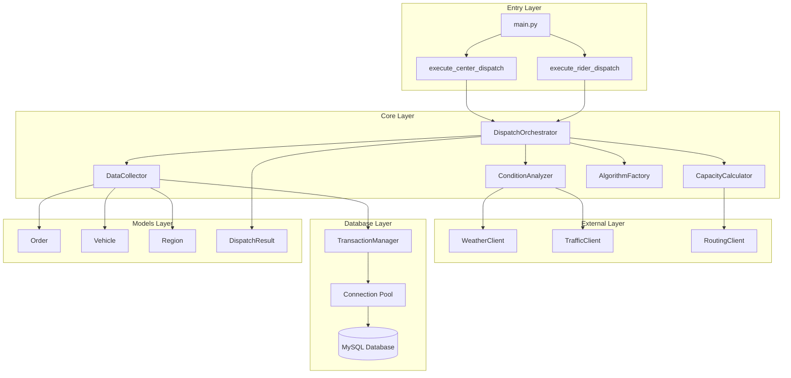

### 2.2 디렉토리 구조

```
tms-router-hybrid/
├── main.py                    # 🎯 실행 진입점
├── core/                      # 🏗️ 핵심 모듈
│   ├── __init__.py
│   ├── services/              # 🔧 비즈니스 서비스
│   │   ├── dispatch_orchestrator.py  # 배차 오케스트레이터
│   │   ├── data_collector.py         # 데이터 수집기
│   │   ├── condition_analyzer.py     # 조건 분석기
│   │   └── capacity_calculator.py    # 용량 계산기
│   ├── models/                # 📦 도메인 모델
│   │   ├── order.py
│   │   ├── vehicle.py
│   │   ├── region.py
│   │   └── dispatch_result.py
│   ├── algorithms/            # 🧮 최적화 알고리즘
│   │   ├── ortools_vrp_algorithm.py
│   │   └── algorithm_factory_simplified.py
│   ├── external/              # 🌐 외부 API 클라이언트
│   │   ├── weather_client.py
│   │   ├── traffic_client.py
│   │   └── routing_client.py
│   ├── database/              # 🗄️ 데이터베이스
│   │   ├── connection.py
│   │   ├── models.py
│   │   └── transaction_manager.py
│   ├── config/                # ⚙️ 설정 관리
│   │   └── settings.py
│   └── utils/                 # 🛠️ 유틸리티
└── requirements.txt
```

---

## 3. 실행 진입점 분석

### 3.1 main.py 실행 흐름

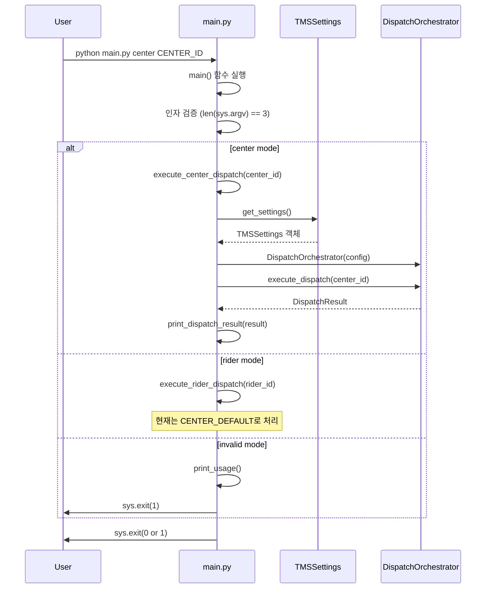

### 3.2 main.py 주요 함수 분석

| 함수명 | 역할 | 입력 | 출력 | 특이사항 |
|--------|------|------|------|----------|
| `main()` | 메인 진입점 | sys.argv | exit code | 인자 검증 및 모드 분기 |
| `execute_center_dispatch()` | 센터 배차 실행 | center_id | success (bool) | 핵심 배차 로직 |
| `execute_rider_dispatch()` | 라이더 배차 실행 | rider_id | success (bool) | TODO: 미구현, 센터 배차로 처리 |
| `print_dispatch_result()` | 결과 출력 | DispatchResult | None | 콘솔 테이블 형태 출력 |
| `print_usage()` | 사용법 출력 | None | None | CLI 가이드 |

### 3.3 설정 시스템 연동

```python
# main.py에서 설정 로드
settings = get_settings()  # TMSSettings 싱글톤 인스턴스

config = {
    'database_url': settings.database_url,
    'weather_api_key': settings.external_api.openweather_api_key,
    'traffic_api_key': settings.external_api.here_api_key
}
```

**설정 우선순위**: 환경변수 → `.env` 파일 → 기본값

---

## 4. 핵심 배차 프로세스

### 4.1 DispatchOrchestrator 7단계 프로세스

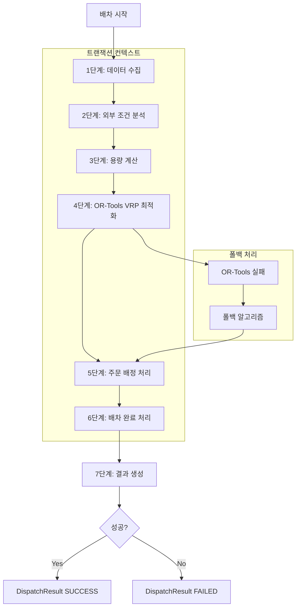

### 4.2 각 단계별 상세 분석

#### 🔍 **1단계: 데이터 수집** (`_collect_data`)
```python
def _collect_data(self, center_id: str, driver_name: str = None) -> Dict:
```

**수행 작업**:
- 대기 중인 주문 조회 (`DataCollector.get_pending_orders`)
- 사용 가능한 차량 조회 (`DataCollector.get_available_vehicles`) 
- 권역 정보 조회 (`DataCollector.get_regions`)
- 제외된 차량 조회 (`DataCollector.get_excluded_vehicles`)
- 데이터 일관성 검증

**검증 로직**:
- 주문이 없으면 `ValueError: "배차할 주문이 없습니다"`
- 차량이 없으면 `ValueError: "사용 가능한 차량이 없습니다"`
- 권역이 없으면 `ValueError: "권역 정보가 없습니다"`

**출력**:
```python
{
    'orders': List[Order],
    'vehicles': List[Vehicle], 
    'regions': List[Region],
    'excluded_vehicles': List[Vehicle]
}
```

#### 🌤️ **2단계: 외부 조건 분석** (`_analyze_conditions`)
```python  
def _analyze_conditions(self, regions: List[Region]) -> Dict:
```

**외부 API 연동**:
- **날씨 조건**: `ConditionAnalyzer.analyze_weather_conditions`
  - OpenWeatherMap API 호출
  - 권역별 날씨 상태 수집
- **교통 조건**: `ConditionAnalyzer.analyze_traffic_conditions`
  - HERE Maps Traffic API 호출
  - 실시간 교통 정체도 분석

**출력**:
```python
{
    'weather': Dict,      # 권역별 날씨 조건
    'traffic': Dict,      # 권역별 교통 조건 
    'feasibility': Dict,  # 배송 실행 가능성
    'emergency': List     # 비상 상황 목록
}
```

#### ⚖️ **3단계: 용량 계산** (`_calculate_capacities`)
```python
def _calculate_capacities(self, vehicles, regions, weather, traffic) -> Dict:
```

**동적 용량 조정**:
- **기사 경험도 반영**: 신입(70%) ~ 전문가(130%)
- **날씨 영향**: 맑음(+10%) ~ 폭풍(-70%)
- **교통 정체**: 원활(+10%) ~ 심각한정체(-40%)

**계산 공식**:
```
최종_용량 = 기본_용량 × 경험도_계수 × 날씨_계수 × 교통_계수 × 권역_난이도_계수
```

#### 🧮 **4단계: OR-Tools VRP 최적화** (`_execute_optimization`)
```python
def _execute_optimization(self, orders, vehicles, capacities, conditions) -> List[VehicleAssignment]:
```

**최적화 알고리즘**:
- **Primary**: OR-Tools VRP (Vehicle Routing Problem)
- **Fallback**: 간단한 권역별 배정 알고리즘
- **제한 시간**: 10분 (600초)

**폴백 조건**:
- OR-Tools 실행 실패
- 최적화 결과 없음
- 시간 초과

#### 💾 **5-6단계: 트랜잭션 처리**
```python
with self.transaction_manager.dispatch_transaction(batch_id, center_id) as tx_context:
    # 5단계: 주문 배정
    tx_context.assign_orders_to_vehicle(assignments)
    
    # 6단계: 배차 완료
    tx_context.complete_dispatch(algorithm_used, execution_time, ...)
```

**트랜잭션 보장**:
- 원자적 주문 배정 (All or Nothing)
- 실패 시 자동 롤백
- 배차 상태 추적

#### 📊 **7단계: 결과 생성** (`_create_dispatch_result`)

**DispatchResult 생성**:
- 배차 성공/실패 상태
- 차량별 배정 정보 
- 메트릭스 (실행시간, 품질점수 등)
- 경고 메시지

---

## 5. 주요 컴포넌트 상세

### 5.1 클래스 다이어그램

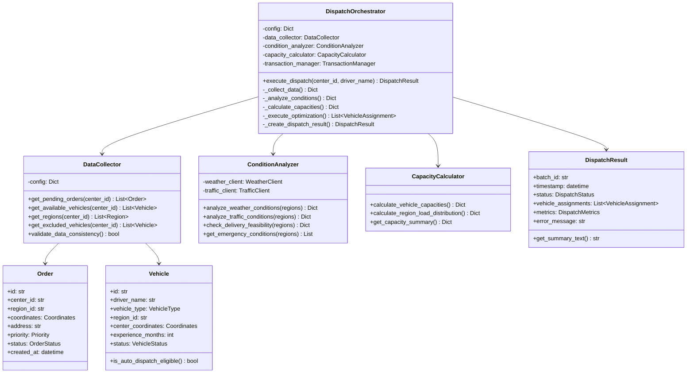

### 5.2 서비스별 주요 메서드

#### 📊 **DataCollector**
| 메서드 | 기능 | SQL 쿼리 대상 | 특이사항 |
|--------|------|---------------|----------|
| `get_pending_orders()` | 대기 주문 조회 | orders 테이블 | status='pending' |
| `get_available_vehicles()` | 사용가능 차량 조회 | vehicles 테이블 | status='ACTIVE' |
| `get_regions()` | 권역 정보 조회 | regions 테이블 | center_id 기준 |
| `validate_data_consistency()` | 데이터 일관성 검증 | - | 외래키 관계 확인 |

#### 🌐 **ConditionAnalyzer**
| 메서드 | 기능 | 외부 API | 캐시 TTL |
|--------|------|----------|----------|
| `analyze_weather_conditions()` | 날씨 분석 | OpenWeatherMap | 30분 |
| `analyze_traffic_conditions()` | 교통 분석 | HERE Maps Traffic | 15분 |
| `check_delivery_feasibility()` | 배송 가능성 판단 | - | - |
| `get_emergency_conditions()` | 비상상황 확인 | - | - |

#### ⚖️ **CapacityCalculator**
| 메서드 | 기능 | 조정 요소 | 계산 공식 |
|--------|------|-----------|----------|
| `calculate_vehicle_capacities()` | 차량별 용량 계산 | 경험도, 날씨, 교통 | base × exp × weather × traffic |
| `calculate_region_load_distribution()` | 권역별 부하 분산 | 차량 수, 권역 크기 | - |
| `get_capacity_summary()` | 용량 요약 정보 | - | 통계 집계 |

---

## 6. 설정 및 외부 연동

### 6.1 TMSSettings 구조

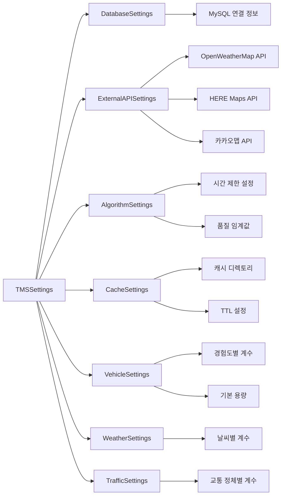

### 6.2 환경변수 설정

```bash
# 데이터베이스
MYSQL_HOST=localhost
MYSQL_PORT=3306
MYSQL_DATABASE=tms_db
MYSQL_USER=tms_user
MYSQL_PASSWORD=tms_password

# 외부 API
OPENWEATHER_API_KEY=your_openweather_key
HERE_API_KEY=your_here_key
KAKAO_REST_API_KEY=your_kakao_key

# 애플리케이션
TMS_DEBUG=false
TMS_LOG_LEVEL=INFO
```

### 6.3 외부 API 연동

#### OpenWeatherMap API
```python
# 날씨 정보 조회
GET https://api.openweathermap.org/data/2.5/weather
    ?lat={latitude}&lon={longitude}&appid={API_KEY}

# 응답 예시
{
    "weather": [{"main": "Clear", "description": "clear sky"}],
    "main": {"temp": 298.15, "humidity": 60},
    "wind": {"speed": 3.5}
}
```

#### HERE Maps Traffic API  
```python
# 교통 정보 조회
GET https://traffic.ls.hereapi.com/traffic/6.0/flow.json
    ?bbox={bbox}&apikey={API_KEY}

# 응답 예시
{
    "RWS": [{
        "FIS": [{
            "FI": [{
                "CF": [{"FF": 25.0, "JF": 0.8}]  # FF: 자유 속도, JF: 정체 비율
            }]
        }]
    }]
}
```

### 6.4 데이터베이스 연결

#### 연결 풀 설정
```python
engine = create_engine(
    database_url,
    poolclass=QueuePool,
    pool_size=10,           # 기본 연결 수
    max_overflow=20,        # 최대 추가 연결 수  
    pool_timeout=30,        # 연결 대기 시간
    pool_recycle=3600       # 연결 재활용 시간(1시간)
)
```

#### 트랜잭션 관리
```python
with transaction_manager.dispatch_transaction(batch_id, center_id) as tx:
    # 모든 DB 작업을 하나의 트랜잭션으로 처리
    tx.assign_orders_to_vehicle(assignments)
    tx.complete_dispatch(...)
    # 성공시 커밋, 실패시 자동 롤백
```

---

## 7. 데이터베이스 아키텍처

### 7.1 데이터베이스 스키마 구조

TMS 시스템은 **MySQL 8.0** 기반으로 **9개 테이블**로 구성된 정규화된 관계형 데이터베이스를 사용합니다.

#### 📊 전체 테이블 관계도

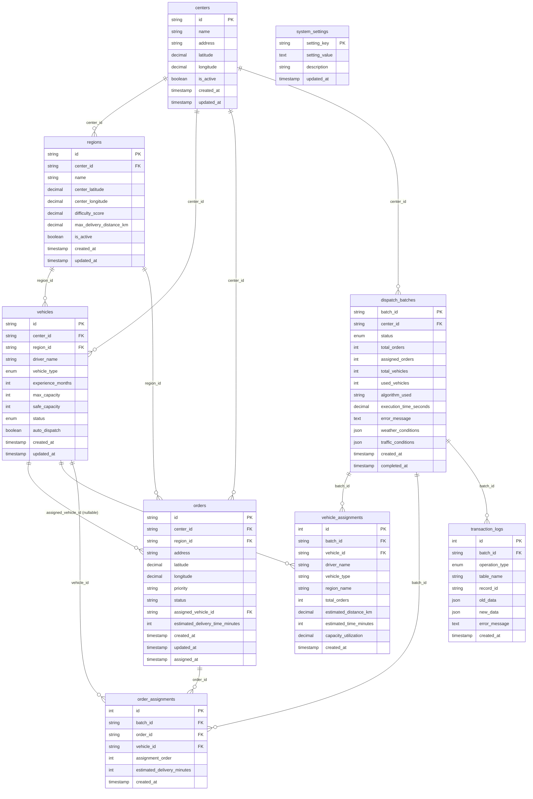

### 7.2 테이블별 상세 설명

#### 🏢 **centers** - 물류센터
```sql
CREATE TABLE centers (
  id varchar(50) PRIMARY KEY,           -- CENTER_GANGNAM, CENTER_SEONGNAM
  name varchar(100) NOT NULL,           -- "강남 물류센터", "성남 물류센터"
  address varchar(255) NOT NULL,        -- 센터 주소
  latitude decimal(10,8) NOT NULL,      -- 위도 (37.5665)
  longitude decimal(11,8) NOT NULL,     -- 경도 (126.9780)
  is_active tinyint(1) DEFAULT 1,       -- 활성 상태
  created_at timestamp DEFAULT CURRENT_TIMESTAMP,
  updated_at timestamp DEFAULT CURRENT_TIMESTAMP ON UPDATE CURRENT_TIMESTAMP
);
```

**주요 인덱스**:
- `idx_centers_active`: 활성 센터 조회 최적화
- `idx_centers_coordinates`: 위치 기반 쿼리 최적화

#### 🗺️ **regions** - 배송 권역
```sql
CREATE TABLE regions (
  id varchar(50) PRIMARY KEY,           -- REGION_GANGNAM_01
  center_id varchar(50) NOT NULL,       -- FK to centers
  name varchar(100) NOT NULL,           -- "강남구 역삼동"
  center_latitude decimal(10,8) NOT NULL,
  center_longitude decimal(11,8) NOT NULL,
  difficulty_score decimal(3,2) DEFAULT 1.00,    -- 권역 난이도 (1.00~5.00)
  max_delivery_distance_km decimal(5,2) DEFAULT 20.00,
  is_active tinyint(1) DEFAULT 1,
  FOREIGN KEY (center_id) REFERENCES centers(id) ON DELETE CASCADE
);
```

#### 🚚 **vehicles** - 차량/기사
```sql
CREATE TABLE vehicles (
  id varchar(50) PRIMARY KEY,           -- VEH_GANGNAM_001
  center_id varchar(50) NOT NULL,       -- FK to centers
  region_id varchar(50) NOT NULL,       -- FK to regions
  driver_name varchar(100) NOT NULL,    -- "김기사"
  vehicle_type ENUM('TOP_CAR','CARGO','OTHER') DEFAULT 'TOP_CAR',
  experience_months int DEFAULT 0,      -- 경험도 (개월)
  max_capacity int DEFAULT 40,          -- 최대 용량
  safe_capacity int DEFAULT 35,         -- 안전 용량
  status ENUM('ACTIVE','INACTIVE','MAINTENANCE','IN_DELIVERY') DEFAULT 'ACTIVE',
  auto_dispatch tinyint(1) DEFAULT 1,   -- 자동 배차 대상 여부
  FOREIGN KEY (center_id) REFERENCES centers(id) ON DELETE CASCADE,
  FOREIGN KEY (region_id) REFERENCES regions(id) ON DELETE CASCADE
);
```

#### 📦 **orders** - 주문
```sql
CREATE TABLE orders (
  id varchar(50) PRIMARY KEY,           -- ORD_20250813_001
  center_id varchar(50) NOT NULL,       -- FK to centers
  region_id varchar(50) NOT NULL,       -- FK to regions
  address varchar(255) NOT NULL,        -- 배송 주소
  latitude decimal(10,8) NOT NULL,
  longitude decimal(11,8) NOT NULL,
  priority varchar(10) DEFAULT 'normal', -- normal, high, urgent
  status varchar(20) DEFAULT 'pending',  -- pending, assigned, completed
  assigned_vehicle_id varchar(50),      -- FK to vehicles (nullable)
  estimated_delivery_time_minutes int,
  created_at timestamp DEFAULT CURRENT_TIMESTAMP,
  assigned_at timestamp NULL,            -- 배정 시간
  FOREIGN KEY (assigned_vehicle_id) REFERENCES vehicles(id) ON DELETE SET NULL
);
```

### 7.3 배차 프로세스별 테이블 데이터 변경 순서

#### 🔄 **배차 실행 프로세스 (execute_dispatch)**

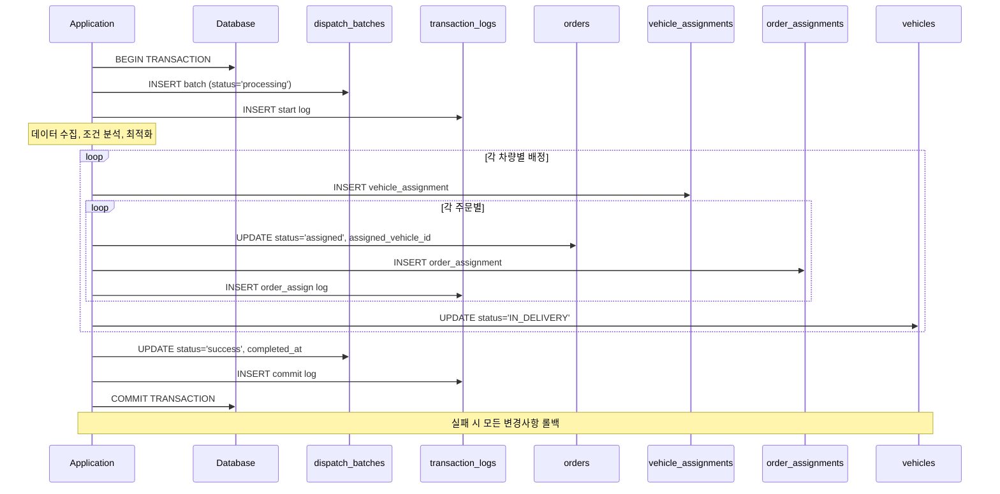

#### 📊 **테이블 데이터 변경 순서표**

| 순서 | 테이블 | 작업 | 데이터 | 트랜잭션 |
|------|--------|------|--------|----------|
| **1** | `dispatch_batches` | INSERT | batch_id, center_id, status='processing' | START |
| **2** | `transaction_logs` | INSERT | operation_type='start' | - |
| **3** | `vehicle_assignments` | INSERT | 차량별 배정 정보 | PROCESSING |
| **4** | `orders` | UPDATE | status='assigned', assigned_vehicle_id | PROCESSING |  
| **5** | `order_assignments` | INSERT | 주문별 배정 순서 | PROCESSING |
| **6** | `vehicles` | UPDATE | status='IN_DELIVERY' | PROCESSING |
| **7** | `transaction_logs` | INSERT | operation_type='order_assign' | PROCESSING |
| **8** | `dispatch_batches` | UPDATE | status='success', metrics, completed_at | COMPLETE |
| **9** | `transaction_logs` | INSERT | operation_type='commit' | COMMIT |

#### ❌ **실패 시 롤백 프로세스**

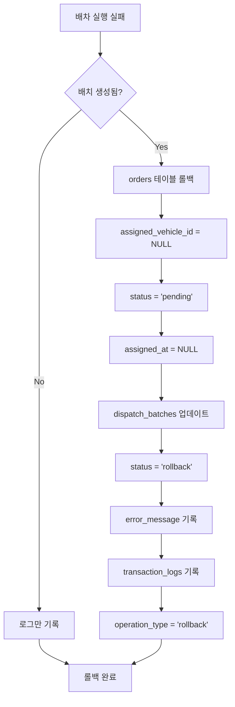

### 7.4 차량별 재배차 프로세스 (execute_vehicle_redispatch)

#### 🔄 **재배차 데이터 흐름**

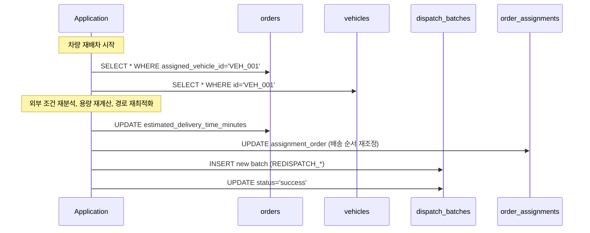

### 7.5 주요 제약 조건 및 데이터 무결성

#### 🔒 **외래키 제약 조건**

| 테이블 | 외래키 | 참조 테이블 | 삭제 정책 | 목적 |
|--------|--------|-------------|-----------|------|
| `regions` | center_id | centers | CASCADE | 센터 삭제 시 권역도 삭제 |
| `vehicles` | center_id | centers | CASCADE | 센터 삭제 시 차량도 삭제 |
| `vehicles` | region_id | regions | CASCADE | 권역 삭제 시 차량도 삭제 |
| `orders` | center_id | centers | CASCADE | 센터 삭제 시 주문도 삭제 |
| `orders` | region_id | regions | CASCADE | 권역 삭제 시 주문도 삭제 |
| `orders` | assigned_vehicle_id | vehicles | SET NULL | 차량 삭제 시 배정 해제 |
| `dispatch_batches` | center_id | centers | CASCADE | 센터 삭제 시 배치도 삭제 |
| `vehicle_assignments` | batch_id | dispatch_batches | CASCADE | 배치 삭제 시 배정도 삭제 |
| `order_assignments` | batch_id | dispatch_batches | CASCADE | 배치 삭제 시 배정도 삭제 |

#### 📏 **주요 인덱스 전략**

```sql
-- 배차 성능 최적화 인덱스
KEY idx_orders_center_region_status (center_id, region_id, status),
KEY idx_vehicles_center_region_status (center_id, region_id, status),
KEY idx_vehicles_auto_dispatch (auto_dispatch),

-- 조회 성능 최적화
KEY idx_orders_assigned_vehicle (assigned_vehicle_id),  -- 차량별 주문 조회
KEY idx_dispatch_batches_created (created_at),          -- 이력 조회
KEY idx_transaction_logs_batch (batch_id),              -- 트랜잭션 추적

-- 위치 기반 쿼리 최적화
KEY idx_centers_coordinates (latitude, longitude),
KEY idx_regions_coordinates (center_latitude, center_longitude),
KEY idx_orders_coordinates (latitude, longitude),
```

#### 🛡️ **데이터 무결성 보장**

1. **배차 원자성**: 트랜잭션 내에서 모든 배정 처리
2. **참조 무결성**: 외래키 제약으로 데이터 일관성 보장  
3. **상태 일관성**: orders.status와 assigned_vehicle_id 동기화
4. **롤백 안정성**: 실패 시 모든 변경사항 원복
5. **동시성 제어**: 트랜잭션 격리 수준으로 경합 상태 방지

---

## 8. 데이터 흐름

### 7.1 전체 데이터 플로우

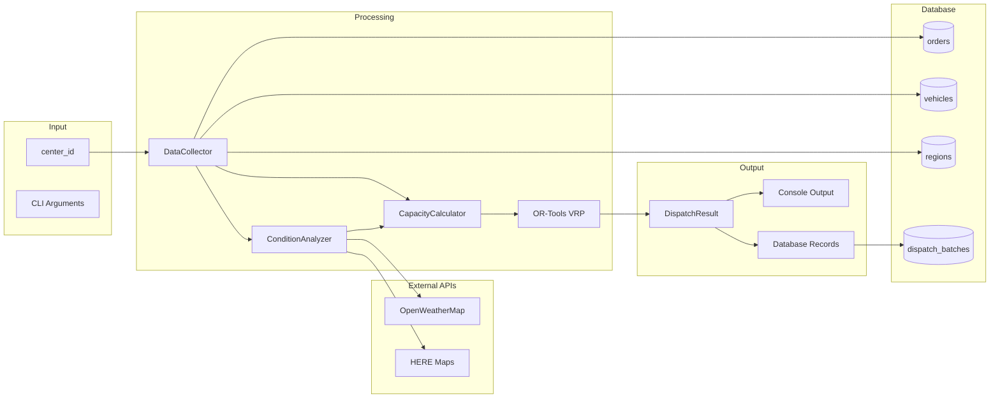

### 7.2 데이터 변환 과정

| 단계 | 입력 데이터 | 처리 과정 | 출력 데이터 |
|------|-------------|-----------|-------------|
| **수집** | center_id | SQL 쿼리 실행 | Orders, Vehicles, Regions |
| **분석** | Regions | API 호출 & 파싱 | Weather/Traffic Conditions |
| **계산** | Vehicles + Conditions | 수학적 계수 적용 | Adjusted Capacities |  
| **최적화** | Orders + Vehicles + Capacities | OR-Tools 알고리즘 | Vehicle Assignments |
| **저장** | Assignments | DB 트랜잭션 | Dispatch Records |

### 7.3 오류 처리 및 폴백

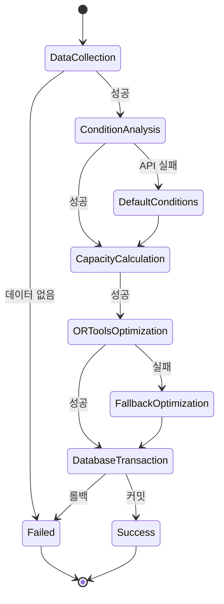

---

## 8. 개발 및 운영 가이드

### 8.1 개발 환경 설정

#### 필요한 소프트웨어
- **Python**: 3.12.0+
- **MySQL**: 8.0+  
- **PyMySQL**: MySQL 클라이언트
- **OR-Tools**: Google 최적화 도구

#### 개발 환경 구성
```bash
# 1. 가상환경 생성
python -m venv venv
source venv/bin/activate  # Windows: venv\Scripts\activate

# 2. 의존성 설치
pip install -r requirements.txt

# 3. 환경변수 설정
cp .env.example .env
# .env 파일 편집

# 4. 데이터베이스 초기화
mysql -u root -p < core/database/scripts/schema.sql

# 5. 테스트 실행
python main.py center CENTER_GANGNAM
```

### 8.2 로깅 및 모니터링

#### 로그 레벨 설정
```python
# settings.py에서 설정
TMS_LOG_LEVEL=DEBUG    # 개발환경
TMS_LOG_LEVEL=INFO     # 운영환경
TMS_LOG_LEVEL=ERROR    # 프로덕션
```

#### 주요 로그 포인트
- **배차 시작/완료**: `dispatch_orchestrator.py`
- **외부 API 호출**: `weather_client.py`, `traffic_client.py`  
- **데이터베이스 트랜잭션**: `transaction_manager.py`
- **최적화 실행**: `ortools_vrp_algorithm.py`

### 8.3 성능 최적화

#### 데이터베이스 최적화
- **인덱스**: orders(center_id, status), vehicles(center_id, status)
- **연결 풀**: 기본 10개, 최대 30개 연결
- **쿼리 최적화**: EXPLAIN으로 실행 계획 확인

#### API 호출 최적화
- **캐싱**: Redis 또는 메모리 캐시 활용
- **병렬 처리**: aiohttp로 비동기 API 호출
- **재시도 로직**: 지수 백오프 적용

#### 알고리즘 최적화
- **시간 제한**: OR-Tools VRP 10분 제한
- **조기 종료**: 품질 임계값 달성시 종료
- **폴백**: 실패시 간단한 알고리즘으로 전환

### 8.4 트러블슈팅

#### 자주 발생하는 오류

| 오류 메시지 | 원인 | 해결 방법 |
|-------------|------|----------|
| "배차할 주문이 없습니다" | DB에 pending 주문 없음 | 테스트 데이터 삽입 |
| "사용 가능한 차량이 없습니다" | 활성 차량 없음 | vehicles 테이블 status 확인 |
| "권역 정보가 없습니다" | regions 테이블 빈 상태 | 권역 데이터 삽입 |
| API 키 관련 오류 | 환경변수 미설정 | .env 파일 확인 |
| DB 연결 실패 | MySQL 서버 중단 | MySQL 서비스 상태 확인 |

#### 성능 문제 해결
1. **느린 쿼리 확인**: MySQL slow query log 활성화
2. **메모리 사용량 체크**: `htop`으로 프로세스 모니터링  
3. **API 응답 시간**: 외부 API 타임아웃 설정 조정
4. **OR-Tools 성능**: 제약 조건 수 줄이기

#### 디버깅 팁
```bash
# 디버그 모드 실행
TMS_DEBUG=true python main.py center CENTER_TEST

# 특정 로거만 활성화  
export TMS_LOG_LEVEL=DEBUG
python main.py center CENTER_TEST 2>&1 | grep "dispatch_orchestrator"

# SQL 쿼리 로그 확인
export MYSQL_ECHO_SQL=true
python main.py center CENTER_TEST
```

### 8.5 배포 가이드

#### 운영 환경 설정
```bash
# 1. 운영 서버 설정
export TMS_DEBUG=false
export TMS_LOG_LEVEL=INFO
export MYSQL_HOST=prod-mysql-server
export OPENWEATHER_API_KEY=production_key

# 2. 데이터베이스 마이그레이션
alembic upgrade head

# 3. 서비스 시작 (예: systemd)
sudo systemctl start tms-router
sudo systemctl enable tms-router
```

#### 모니터링 포인트
- **배차 성공률**: 목표 95% 이상
- **평균 실행 시간**: 목표 30초 이내  
- **API 응답 시간**: OpenWeatherMap <5초, HERE Maps <10초
- **데이터베이스 연결**: 활성 연결 수 모니터링

---

## 📚 참고 자료

- **OR-Tools 문서**: https://developers.google.com/optimization/routing/vrp
- **OpenWeatherMap API**: https://openweathermap.org/api
- **HERE Maps API**: https://developer.here.com/
- **Pydantic 문서**: https://docs.pydantic.dev/
- **SQLAlchemy 문서**: https://docs.sqlalchemy.org/

---

> **문서 버전**: 1.0.0  
> **최종 수정**: 2025-08-13  
> **작성자**: TMS 개발팀  
> **검토자**: [백엔드 팀 리드]