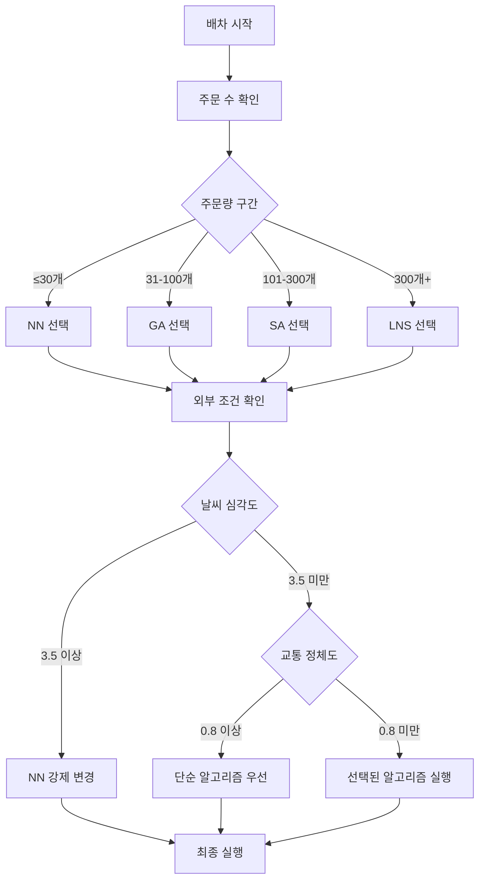
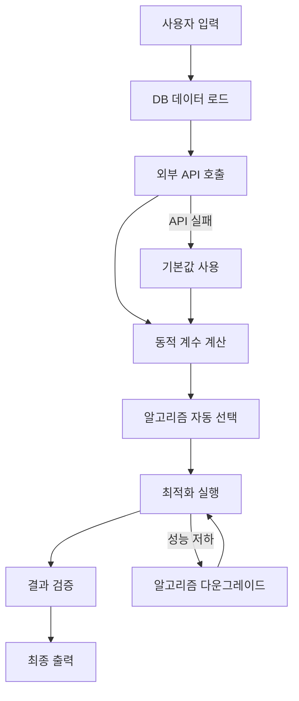

# TMS 배차 시스템 - 실행 가이드

## 1. 시스템 개요

TMS Router Hybrid는 완전 자동화된 배차 시스템입니다. 사용자는 센터 또는 라이더만 지정하면, 시스템이 모든 최적화 과정을 자동으로 처리합니다.

## 2. 실행 명령어

### 2.1 기본 실행 (둘 중 하나 필수)

```bash
# 센터 기준 배차
python dispatch.py --center "강남센터"

# 라이더 기준 배차  
python dispatch.py --rider "김기사"
```

### 2.2 환경 설정 (최초 1회)

```bash
# MariaDB 컨테이너 시작
docker-compose up -d mariadb

# 데이터베이스 초기화
python init_database.py

# 환경 변수 설정 (선택사항)
export OPENWEATHER_API_KEY="your_key_here"    # 없으면 기본값 사용
export HERE_API_KEY="your_key_here"           # 없으면 기본값 사용
```

## 3. 알고리즘 선택 통합 가이드

### 3.1 빠른 참조 테이블

| 주문량 | 기본 알고리즘 | 처리 시간 | 품질 | 악천후시 | 교통정체시 |
|--------|---------------|-----------|------|----------|------------|
| ≤30개 | Nearest Neighbor | 30초 | 70-80% | 그대로 | 그대로 |
| 31-100개 | Genetic Algorithm | 2-5분 | 85-90% | → NN | → NN/GA |
| 101-300개 | Simulated Annealing | 5-10분 | 88-93% | → NN | → GA |
| 300개+ | Large Neighborhood Search | 8-15분 | 90-95% | → NN | → SA |

### 3.2 알고리즘 선택 플로우



### 3.3 실제 시나리오 예시

#### 시나리오 1: 중규모 배차 (일반 상황)
```
조건: 85개 주문 + 맑음 + 원활한 교통
과정: 85개 → GA 선택 → 외부조건 양호 → GA 실행
결과: 3-4분 처리, 87% 품질
```

#### 시나리오 2: 대규모 배차 (악천후)
```
조건: 320개 주문 + 폭우 + 일반 교통  
과정: 320개 → LNS 선택 → 폭우 감지 → NN 다운그레이드
결과: 1-2분 처리, 75% 품질 (안전성 우선)
```

#### 시나리오 3: 소규모 배차 (교통정체)
```
조건: 25개 주문 + 흐림 + 심각한 정체
과정: 25개 → NN 선택 → 정체 감지 → NN 유지
결과: 30초 처리, 72% 품질 (빠른 처리)
```

### 3.4 알고리즘별 특성 요약

#### Nearest Neighbor (최근접 이웃)
```
✅ 장점: 매우 빠른 처리 (30초), 단순한 로직
❌ 단점: 낮은 최적화 품질 (70-80%)
🎯 적합: 소량 주문, 긴급 상황, 악천후
📝 로직: 가장 가까운 주문부터 순차 배정
```

#### Genetic Algorithm (유전자 알고리즘)
```
✅ 장점: 속도-품질 균형, 안정적 성능
❌ 단점: 중간 수준의 처리 시간
🎯 적합: 중간 규모 주문, 일반적 상황
📝 로직: 진화 연산으로 해 개선, 인구 100-200
```

#### Simulated Annealing (시뮬레이티드 어닐링)  
```
✅ 장점: 높은 품질 (88-93%), 국소 최적해 회피
❌ 단점: 긴 처리 시간
🎯 적합: 대규모 주문, 품질 중시 상황
📝 로직: 확률적 해 탐색, 점진적 온도 감소
```

#### Large Neighborhood Search (대규모 근방 탐색)
```
✅ 장점: 최고 품질 (90-95%), 대용량 처리
❌ 단점: 가장 긴 처리 시간
🎯 적합: 초대규모 주문, 최적화 우선
📝 로직: 대규모 재배치 + 지능형 재구성
```

### 3.5 동적 전환 및 폴백 전략

#### 실시간 알고리즘 전환
```
성능 모니터링:
├── 예상 시간 대비 80% → 전환 검토
├── 예상 시간 대비 90% → 강제 전환  
└── 예상 시간 대비 95% → 현재 해 반환

전환 우선순위:
LNS → SA → GA → NN (성능 저하 시)
NN ← GA ← SA ← LNS (품질 개선 시)
```

#### API 장애 시 대응
```
경로 계산 API 실패:
1순위: OpenRouteService → 실패
2순위: HERE Maps → 실패  
3순위: Kakao Maps → 실패
4순위: Mapbox → 실패
최종: 하버사인 + 도로계수 (추정값)

외부 데이터 API 실패:
날씨 API 실패 → 기본값 사용 (맑음 가정)
교통 API 실패 → 캐시 데이터 또는 기본값
```

### 3.6 복잡도 점수 기반 고급 선택 (참고)

복잡도 = 주문량(40%) + 지리분산(25%) + 시간제약(20%) + 용량제약(15%)

```
점수 1.0-1.5: Nearest Neighbor
점수 1.5-2.5: Capacity First Fit
점수 2.5-3.0: Genetic Algorithm  
점수 3.0-3.5: Simulated Annealing
점수 3.5-4.0: Large Neighborhood Search
점수 4.0+: Hybrid Algorithm (GA + SA)
```

이 가이드를 통해 시스템이 어떤 상황에서 어떤 알고리즘을 선택하는지 명확히 파악할 수 있습니다.

## 4. 데이터베이스 스키마

### 4.1 핵심 테이블 구조

```sql
-- 기사 정보
CREATE TABLE drivers (
    id INT PRIMARY KEY AUTO_INCREMENT,
    name VARCHAR(100) NOT NULL,
    experience_months INT DEFAULT 0,           -- 경험도 (개월)
    vehicle_type ENUM('bike','car','truck') NOT NULL,
    status ENUM('active','inactive') DEFAULT 'active',
    created_at TIMESTAMP DEFAULT CURRENT_TIMESTAMP
);

-- 센터 정보
CREATE TABLE centers (
    id INT PRIMARY KEY AUTO_INCREMENT,
    name VARCHAR(100) NOT NULL,
    latitude DECIMAL(10,8) NOT NULL,
    longitude DECIMAL(11,8) NOT NULL,
    address VARCHAR(255),
    status ENUM('active','inactive') DEFAULT 'active'
);

-- 권역 정보
CREATE TABLE zones (
    id INT PRIMARY KEY AUTO_INCREMENT,
    zone_name VARCHAR(100) NOT NULL,
    center_id INT,
    difficulty_score DECIMAL(2,1) DEFAULT 2.5,  -- 1.0-5.0
    road_access_score INT DEFAULT 2,            -- 1-4
    parking_score INT DEFAULT 2,                -- 1-4
    FOREIGN KEY (center_id) REFERENCES centers(id)
);

-- 차량 정보  
CREATE TABLE vehicles (
    id INT PRIMARY KEY AUTO_INCREMENT,
    driver_id INT,
    vehicle_type ENUM('탑차','카고','기타') NOT NULL,
    max_capacity INT DEFAULT 40,                -- 최대 적재 가능
    safe_capacity INT DEFAULT 35,              -- 여유 적재 용량
    zone_id INT,                               -- 담당 권역
    status ENUM('active','inactive') DEFAULT 'active',
    auto_dispatch BOOLEAN DEFAULT true,        -- 자동배차 가능 여부
    FOREIGN KEY (driver_id) REFERENCES drivers(id),
    FOREIGN KEY (zone_id) REFERENCES zones(id)
);

-- 조정 계수 설정
CREATE TABLE adjustment_factors (
    id INT PRIMARY KEY AUTO_INCREMENT,
    factor_type ENUM('weather','traffic','experience','zone') NOT NULL,
    condition_key VARCHAR(50) NOT NULL,        -- 'clear', 'rain', 'level_1' 등
    condition_value VARCHAR(100),              -- 상세 설명
    multiplier DECIMAL(3,2) NOT NULL,          -- 0.30 ~ 1.30
    is_active BOOLEAN DEFAULT true
);

-- 주문 정보
CREATE TABLE orders (
    id INT PRIMARY KEY AUTO_INCREMENT,
    center_id INT,
    zone_id INT,
    latitude DECIMAL(10,8) NOT NULL,
    longitude DECIMAL(11,8) NOT NULL,
    address VARCHAR(255) NOT NULL,
    priority ENUM('low','normal','high') DEFAULT 'normal',
    status ENUM('pending','assigned','completed') DEFAULT 'pending',
    created_at TIMESTAMP DEFAULT CURRENT_TIMESTAMP,
    FOREIGN KEY (center_id) REFERENCES centers(id),
    FOREIGN KEY (zone_id) REFERENCES zones(id)
);
```

### 4.2 기본 데이터 예시

```sql
-- 기사 정보 샘플 데이터
INSERT INTO drivers (name, experience_months) VALUES
('김신입', 2),      -- 신입 (70% 용량)
('이초급', 8),      -- 초급 (85% 용량)  
('박중급', 24),     -- 중급 (100% 용량)
('최고급', 48),     -- 고급 (115% 용량)
('장전문', 96);     -- 전문가 (130% 용량)

-- 차량 정보 샘플 데이터
INSERT INTO vehicles (driver_id, vehicle_type, max_capacity, safe_capacity, auto_dispatch) VALUES
(1, '카고', 40, 35, true),
(2, '탑차', 40, 35, true),  
(3, '탑차', 40, 35, true),
(4, '카고', 40, 35, true),
(5, '기타', 0, 0, false);   -- 자동배차 제외

-- 조정 계수 설정
INSERT INTO adjustment_factors (factor_type, condition_key, multiplier) VALUES
('weather', 'clear', 1.10),
('weather', 'rain', 0.80),
('weather', 'heavy_rain', 0.60),
('weather', 'snow', 0.50),
('traffic', 'smooth', 1.10),
('traffic', 'normal', 1.00),
('traffic', 'congested', 0.80),
('traffic', 'heavy_congested', 0.60),
('experience', 'level_1', 0.70),
('experience', 'level_2', 0.85),
('experience', 'level_3', 1.00),
('experience', 'level_4', 1.15),
('experience', 'level_5', 1.30),
('vehicle', '탑차', 1.0),
('vehicle', '카고', 1.0),
('vehicle', '기타', 0.0);
```

## 5. 자동 처리 플로우

### 5.1 전체 처리 과정



### 5.2 내부 처리 상세

```python
class VehicleCapacityManager:
    def get_available_vehicles(self, center_or_rider):
        """자동배차 가능한 차량만 조회 (탑차/카고만)"""
        query = """
        SELECT v.*, d.name as driver_name, d.experience_months
        FROM vehicles v
        JOIN drivers d ON v.driver_id = d.id  
        WHERE v.status = 'active' 
        AND v.auto_dispatch = true
        AND v.vehicle_type IN ('탑차', '카고')
        """
        return self.db.execute(query)
    
    def calculate_vehicle_capacity(self, vehicle, adjustments):
        """차량별 동적 용량 계산"""
        if vehicle['vehicle_type'] in ['탑차', '카고']:
            base_capacity = 35  # 여유 용량 기준
            
            # 경험도/날씨/교통 조정 적용
            adjusted = base_capacity * adjustments['total_factor']
            
            # 최대 40개 제한
            return min(int(adjusted), 40)
        else:
            return 0  # 기타 차종은 자동배차 제외

class AutoDispatchSystem:
    def execute(self, center=None, rider=None):
        """완전 자동화된 배차 처리"""
        
        # 1. 자동배차 가능한 차량만 로드 (탑차/카고)
        vehicles = self.capacity_manager.get_available_vehicles(center)
        orders = self._load_orders(center, rider)
        zones = self._load_zones()
        factors = self._load_adjustment_factors()
        
        # 2. 기타 차종 차량은 별도 보고
        excluded_vehicles = self._get_excluded_vehicles(center)
        
        # 3. 외부 조건 자동 수집 (실패시 기본값)
        weather = self._get_weather_or_default()
        traffic = self._get_traffic_or_default()
        
        # 4. 동적 용량 자동 계산 (최대 40개 제한)
        adjusted_capacities = self._calculate_capacities(
            vehicles, weather, traffic, factors
        )
        
        # 5. 알고리즘 자동 선택
        algorithm = self._select_algorithm(len(orders), weather, traffic)
        
        # 6. 탑차/카고만으로 배차 최적화 실행
        result = self._execute_with_fallback(
            algorithm, orders, adjusted_capacities
        )
        
        # 7. 수동 배차 대상 차량 정보 포함
        result['manual_dispatch_required'] = excluded_vehicles
        
        # 8. 결과 자동 검증 및 반환
        return self._validate_and_format(result)
```

## 6. 출력 형식

### 6.1 성공적인 실행 결과

```bash
$ python dispatch.py --center "강남센터"

=== TMS 배차 결과 ===
처리 시간: 2024-08-08 14:30:15
센터: 강남센터  
총 주문: 85개
사용 알고리즘: Genetic Algorithm
처리 시간: 3분 24초

=== 자동 배차 완료 ===
김기사(탑차): 35개 주문 - 강남1권역
박기사(카고): 32개 주문 - 강남2권역  
최기사(탑차): 18개 주문 - 강남3권역

배차 완료: 85개 주문
남은 주문: 0개

=== 수동 배차 필요 차량 ===
⚠️ 다음 차량들은 수동 배차가 필요합니다:
- 이기사(기타): 수동 배차 대기
- 정기사(기타): 수동 배차 대기

=== 품질 지표 ===
자동 배차율: 100% (85/85개)
평균 차량 적재율: 87.2% (35개 기준)
예상 배송 시간: 4시간 15분

=== 적용된 조정 ===
날씨 조건: 맑음 (×1.1)
교통 상황: 보통 (×1.0)  
평균 기사 경험: Level 3.2
차량 구성: 탑차 2대, 카고 1대
```

### 6.2 오류 상황 처리

```bash
$ python dispatch.py --center "없는센터"

=== 오류 발생 ===
오류: 지정된 센터를 찾을 수 없습니다.
사용 가능한 센터: 강남센터, 서초센터, 송파센터

$ python dispatch.py --center "강남센터"

=== 경고 ===  
날씨 API 접근 실패 - 기본값 사용
교통 API 응답 지연 - 캐시 데이터 사용

=== TMS 배차 결과 ===
(정상 처리 계속...)
```

## 7. 시스템 모니터링

### 7.1 로그 확인

```bash
# 실행 로그 확인
tail -f logs/dispatch.log

# 성능 로그 확인  
tail -f logs/performance.log

# 오류 로그 확인
tail -f logs/error.log
```

### 7.2 캐시 상태 확인

```bash
# 캐시 히트율 확인
python utils/cache_stats.py

# 캐시 정리 (필요시)
python utils/clear_cache.py
```

## 8. 문제 해결

### 8.1 일반적인 문제

```
Q: "No orders found" 오류가 발생합니다.
A: 지정한 센터/라이더에 배정된 주문이 없습니다. 
   orders 테이블의 데이터를 확인하세요.

Q: 알고리즘이 너무 오래 걸립니다.  
A: 시스템이 자동으로 더 빠른 알고리즘으로 전환합니다.
   성능 저하가 지속되면 DB 인덱스를 확인하세요.

Q: 외부 API가 계속 실패합니다.
A: 시스템이 자동으로 기본값을 사용합니다. 
   API 키 설정을 확인하세요.
```

### 8.2 데이터베이스 문제

```sql
-- 인덱스 확인 및 생성
CREATE INDEX idx_orders_center ON orders(center_id, status);  
CREATE INDEX idx_vehicles_zone ON vehicles(zone_id, status);
CREATE INDEX idx_drivers_status ON drivers(status);
CREATE INDEX idx_vehicles_auto_dispatch ON vehicles(auto_dispatch, vehicle_type);

-- 데이터 정합성 확인
SELECT * FROM orders WHERE center_id NOT IN (SELECT id FROM centers);
SELECT * FROM vehicles WHERE zone_id NOT IN (SELECT id FROM zones);

-- 차량별 자동배차 현황 확인
SELECT vehicle_type, COUNT(*) as count, 
       SUM(CASE WHEN auto_dispatch THEN 1 ELSE 0 END) as auto_dispatch_count
FROM vehicles 
WHERE status = 'active'
GROUP BY vehicle_type;
```

## 9. 차종별 배차 규칙 요약

### 9.1 자동 배차 대상
```
🚛 탑차 (Top Car)
├── 최대 적재: 40개
├── 배차 용량: 35개 (여유 고려)
├── 자동 배차: ✅ 가능
└── 우선 배정: 대량 주문 권역

🚐 카고 (Cargo)  
├── 최대 적재: 40개
├── 배차 용량: 35개 (여유 고려)
├── 자동 배차: ✅ 가능
└── 우선 배정: 일반 주문 권역
```

### 9.2 수동 배차 대상
```
❓ 기타 (Others)
├── 최대 적재: 미정
├── 배차 용량: 0개 (자동배차 제외)
├── 자동 배차: ❌ 불가
└── 처리 방식: 관리자 수동 배차 필요
```

### 9.3 용량 계산 공식
```
최종 배차량 = MIN(
    35개 × 경험도계수 × 날씨계수 × 교통계수,
    40개  // 절대 최대 제한
)

예시:
- 중급 기사 (1.0) + 맑음 (1.1) + 원활 (1.1) = 35 × 1.21 = 42개 → 40개로 제한
- 신입 기사 (0.7) + 비 (0.8) + 정체 (0.8) = 35 × 0.448 = 15개
```

이 시스템은 탑차/카고는 완전 자동화하고, 기타 차종은 수동 관리하여 효율성과 유연성을 동시에 확보하도록 설계되었습니다.