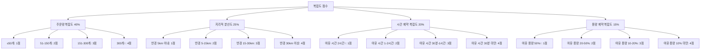
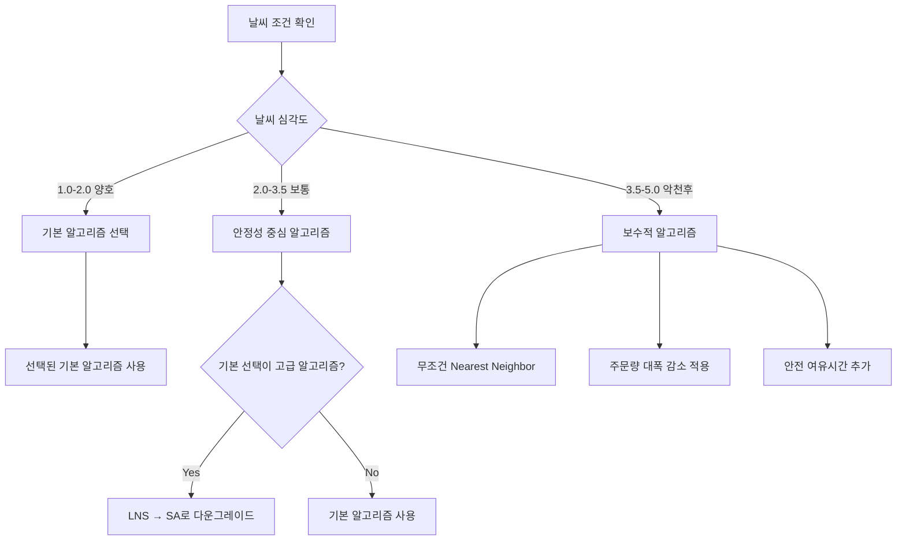
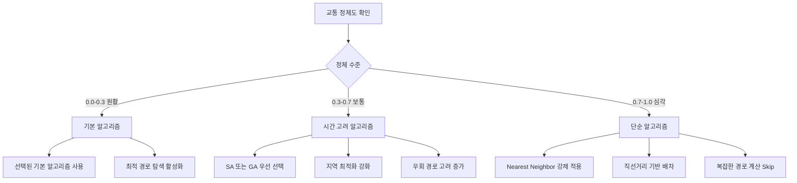
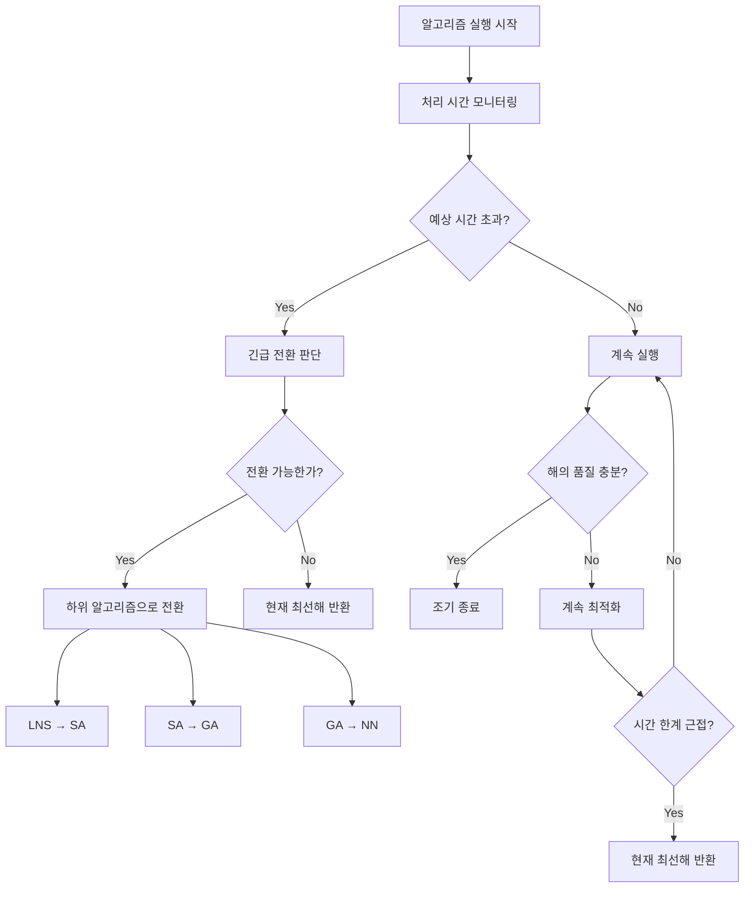
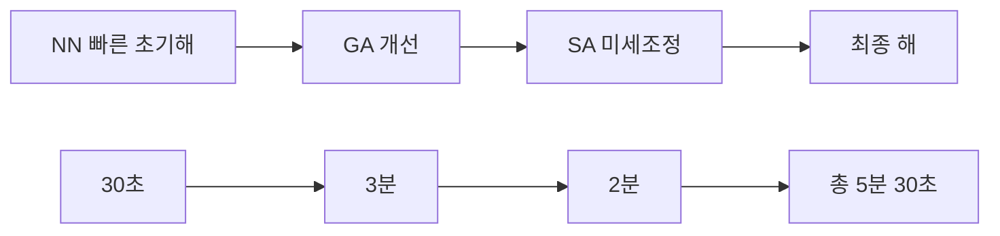
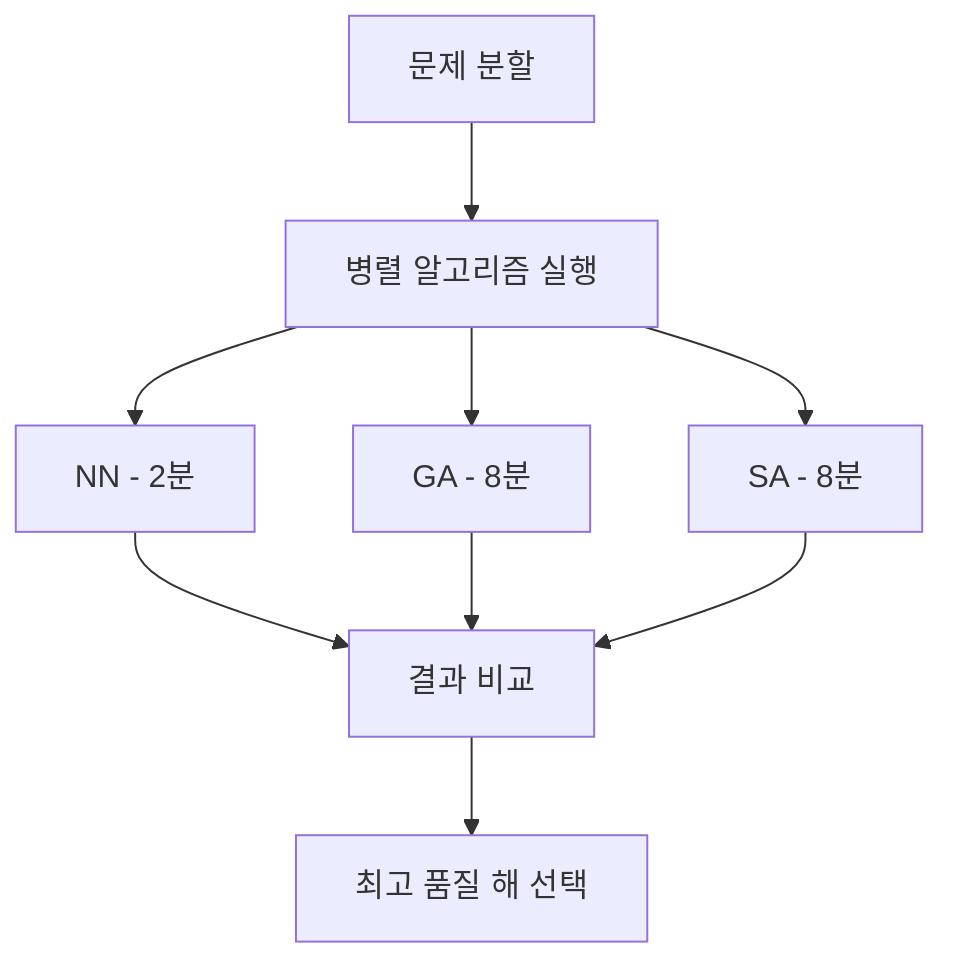
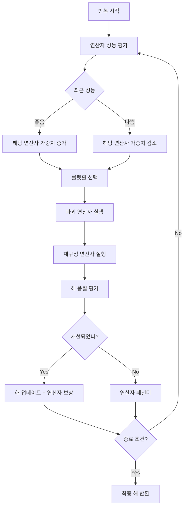
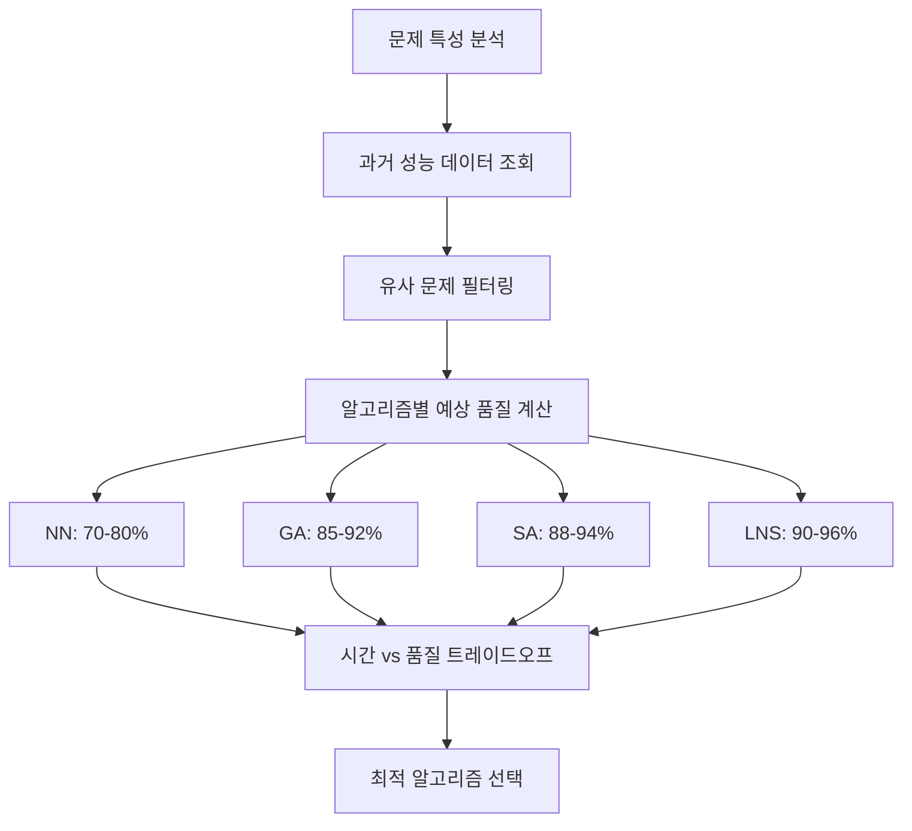

# TMS 배차 시스템 - 알고리즘 선택 룰과 로직

## 1. 알고리즘 선택 매트릭스

### 1.1 기본 선택 기준

#### 주문량 기반 1차 필터링
```
주문 수 ≤ 30개: 
  - Nearest Neighbor (최근접 이웃)
  - 예상 처리 시간: 30초 이내
  - 해의 품질: 70-80%

주문 수 31-100개:
  - Genetic Algorithm (유전자 알고리즘)
  - 예상 처리 시간: 2-5분
  - 해의 품질: 85-90%

주문 수 101-300개:
  - Simulated Annealing (시뮬레이티드 어닐링)
  - 예상 처리 시간: 5-10분  
  - 해의 품질: 88-93%

주문 수 300개 이상:
  - Large Neighborhood Search (대규모 근방 탐색)
  - 예상 처리 시간: 8-10분
  - 해의 품질: 90-95%
```

### 1.2 복잡도 점수 계산 룰

#### 복잡도 구성 요소


#### 최종 복잡도 점수 및 알고리즘 매핑
```
복잡도 점수 1.0-1.5: Nearest Neighbor
복잡도 점수 1.5-2.5: Capacity First Fit
복잡도 점수 2.5-3.0: Genetic Algorithm
복잡도 점수 3.0-3.5: Simulated Annealing
복잡도 점수 3.5-4.0: Large Neighborhood Search
복잡도 점수 4.0↑: Hybrid Algorithm (GA + SA)
```

## 2. 상황별 알고리즘 선택 로직

### 2.1 날씨 조건별 알고리즘 조정



#### 날씨별 알고리즘 선택 룰
```
맑음/흐림 (심각도 1.0-2.0):
  - 기본 선택 로직 그대로 적용
  - 성능 최적화 우선

비/안개 (심각도 2.0-3.5):
  - 복잡한 알고리즘 사용 시 안정성 확인
  - 처리 시간을 품질보다 우선
  - LNS 사용 시 → SA로 변경

폭우/폭설/태풍 (심각도 3.5-5.0):
  - 무조건 Nearest Neighbor 사용
  - 빠른 처리와 단순함 우선
  - 주문량 감소가 이미 적용된 상태
```

### 2.2 교통 상황별 알고리즘 조정



### 2.3 시간 제약별 알고리즘 선택

#### 처리 시간 기반 선택 매트릭스
```
사용 가능 시간 ≤ 2분:
  - Nearest Neighbor 고정
  - 간단한 휴리스틱만 사용

사용 가능 시간 2-5분:
  - Genetic Algorithm (세대수 제한)
  - 인구수: 50, 최대 세대: 100

사용 가능 시간 5-10분:
  - Simulated Annealing (표준 설정)
  - 또는 GA (세대수: 200-300)

사용 가능 시간 10분:
  - Large Neighborhood Search
  - 또는 Hybrid Algorithm
```

## 3. 동적 알고리즘 전환 로직

### 3.1 실시간 성능 기반 전환



#### 전환 트리거 조건
```
시간 기반 전환:
  - 예상 시간의 80% 도달 시 전환 검토
  - 90% 도달 시 무조건 전환
  - 95% 도달 시 현재 해 반환

품질 기반 조기 종료:
  - 목표 품질 달성 시 조기 종료
  - 품질 개선이 5회 연속 없을 시 종료
  - 최소 실행 시간(30초) 보장
```

### 3.2 알고리즘 조합 전략

#### 순차 실행 방식


#### 병렬 실행 방식 (10분 제한 내에서)


## 4. 알고리즘별 세부 최적화 룰

### 4.1 Genetic Algorithm 최적화 룰

#### 인구 크기 동적 조정
```
주문 수 ≤ 50: 인구 50
주문 수 51-100: 인구 100
주문 수 101-200: 인구 150
주문 수 200↑: 인구 200

시간 제약이 있는 경우:
  - 기본 인구의 70% 사용
  - 세대 수를 150% 증가
```

#### 교배 및 돌연변이율 조정
```
초기 단계 (1-30세대):
  - 교배율: 0.8
  - 돌연변이율: 0.15 (높은 탐색)

중간 단계 (31-70세대):
  - 교배율: 0.7
  - 돌연변이율: 0.08

후반 단계 (71세대↑):
  - 교배율: 0.6
  - 돌연변이율: 0.03 (수렴 집중)
```

### 4.2 Simulated Annealing 최적화 룰

#### 온도 스케줄링
```
초기 온도: 1000 * 문제_복잡도
최종 온도: 1.0
냉각 계수: 0.95 (기본)

동적 냉각 계수 조정:
  - 수용률 > 80%: α = 0.98 (천천히)
  - 수용률 < 20%: α = 0.90 (빠르게)
  - 수용률 20-80%: α = 0.95 (표준)
```

#### 이웃해 생성 전략
```
온도가 높을 때 (T > 100):
  - 큰 변화 허용 (3-5개 주문 재배치)
  
온도가 중간일 때 (10 < T ≤ 100):
  - 중간 변화 (2-3개 주문 재배치)
  
온도가 낮을 때 (T ≤ 10):
  - 작은 변화 (1-2개 주문 재배치)
```

### 4.3 Large Neighborhood Search 최적화 룰

#### 파괴-재구성 연산자 선택


#### 연산자별 사용 조건
```
Random Removal: 초기 다양성 확보
Related Removal: 지역적 클러스터 최적화  
Worst Removal: 비효율적 배치 제거
Shaw Removal: 유사 특성 주문 재배치

Greedy Insertion: 빠른 재구성
Best Insertion: 품질 우선 재구성
Regret Insertion: 기회비용 고려
```

## 5. 알고리즘 성능 예측 모델

### 5.1 예상 처리시간 계산

```
NN 예상 시간 = 0.1 * N² (초)
GA 예상 시간 = (P * G * 0.05 * N) (초)
  P: 인구수, G: 세대수, N: 주문수
SA 예상 시간 = (I * 0.02 * N) (초)  
  I: 반복횟수, N: 주문수
LNS 예상 시간 = (I * 0.8 * √N) (초)
  I: 반복횟수, N: 주문수
```

### 5.2 해의 품질 예측



이 문서는 TMS 배차 시스템의 알고리즘 선택과 최적화에 대한 상세한 룰과 로직을 제시합니다.