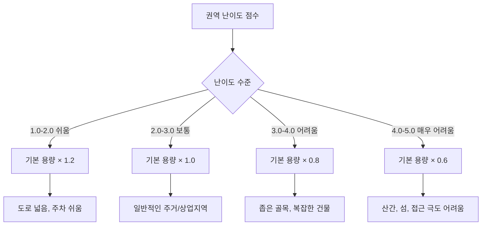
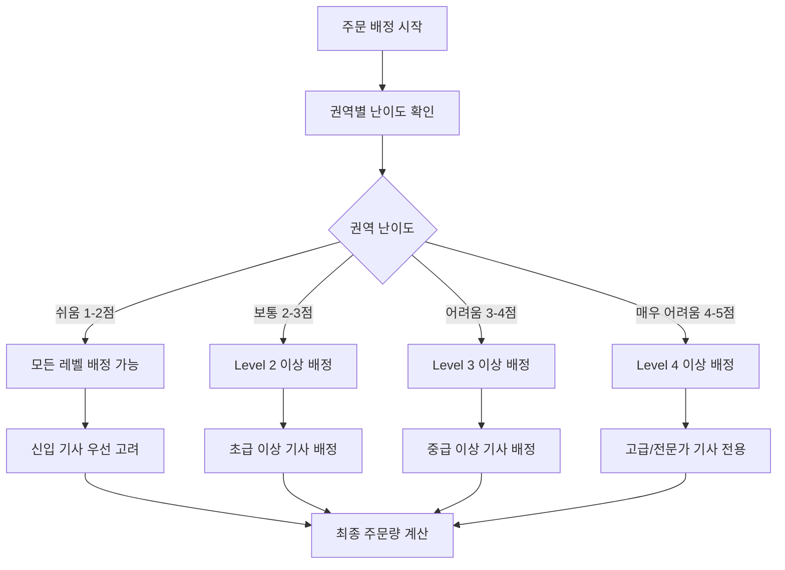
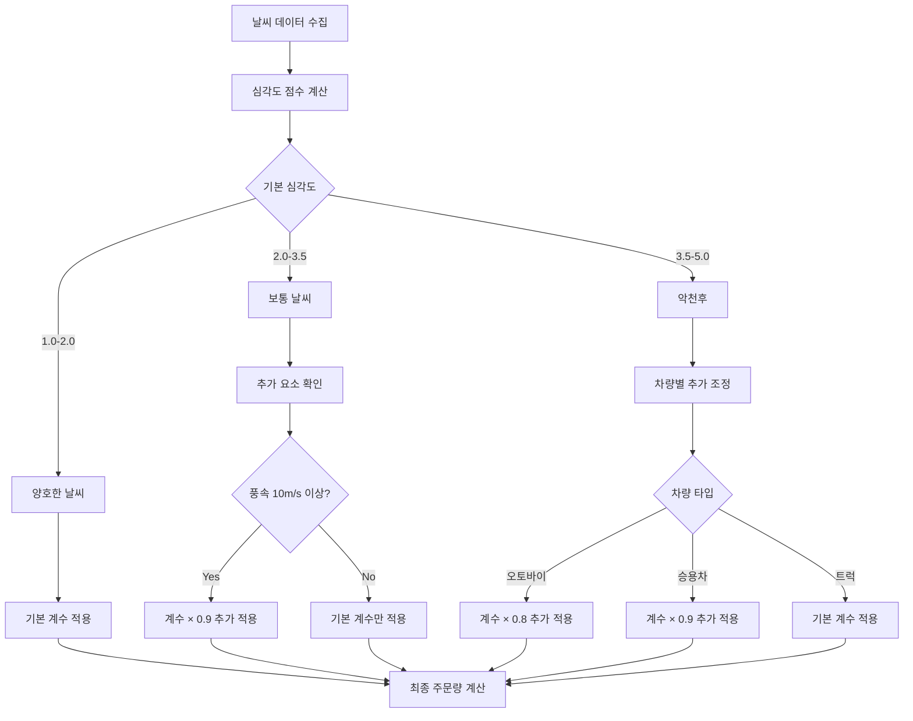
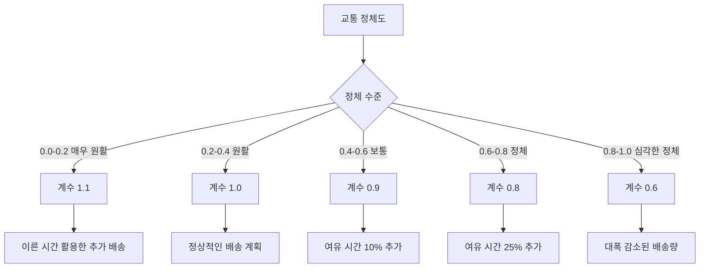
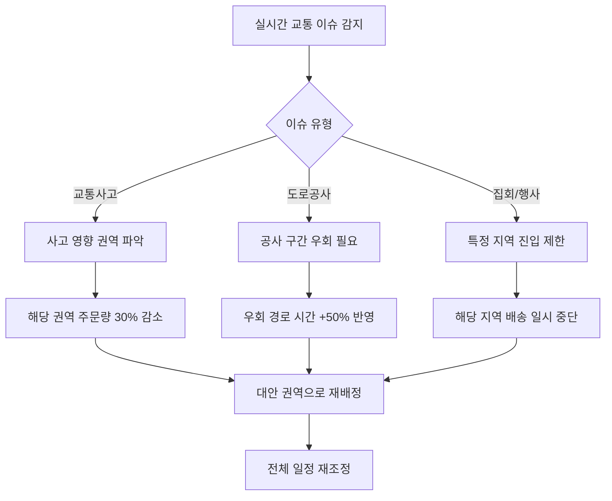
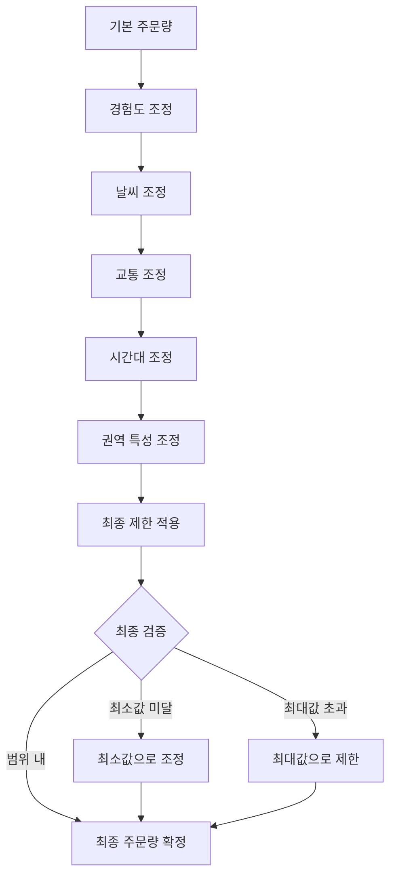

# TMS 배차 시스템 - 동적 주문량 조정 룰과 로직

## 1. 기본 주문량 계산 룰

### 1.1 차량 타입별 기본 용량

```
오토바이 (Bike):
  - 도심지: 6-8개 주문
  - 교외지역: 8-10개 주문  
  - 시골지역: 10-12개 주문

승용차 (Car):
  - 도심지: 10-12개 주문
  - 교외지역: 12-15개 주문
  - 시골지역: 15-18개 주문

트럭 (Truck):
  - 도심지: 18-20개 주문
  - 교외지역: 20-25개 주문
  - 시골지역: 25-30개 주문
```

### 1.2 권역 난이도별 조정 계수



#### 권역 난이도 측정 요소
```
도로 접근성 (40%):
  - 대로변 접근: 1점
  - 이면도로: 2점  
  - 골목길: 3점
  - 도보 전용: 4점

주차 편의성 (30%):
  - 전용 주차장: 1점
  - 도로변 주차 가능: 2점
  - 주차 어려움: 3점
  - 주차 불가능: 4점

건물 밀집도 (20%):
  - 단독주택: 1점
  - 저층 아파트: 2점
  - 고층 아파트: 3점
  - 오피스텔/상가 복합: 4점

교통 복잡도 (10%):
  - 한적함: 1점
  - 보통: 2점
  - 복잡함: 3점
  - 매우 복잡: 4점
```

## 2. 기사 경험도 기반 조정

### 2.1 경험도 레벨 정의

```
Level 1 (신입): 3개월 미만
  - 기본 용량의 70% 적용
  - 복잡한 권역 배정 지양
  - 시간 여유 20% 추가 확보

Level 2 (초급): 3-12개월
  - 기본 용량의 85% 적용
  - 보통 권역까지 배정 가능
  - 시간 여유 10% 추가 확보

Level 3 (중급): 1-3년
  - 기본 용량의 100% 적용
  - 모든 권역 배정 가능
  - 표준 시간 적용

Level 4 (고급): 3-7년
  - 기본 용량의 115% 적용
  - 어려운 권역 우선 배정
  - 시간 10% 단축 가능

Level 5 (전문가): 7년 이상
  - 기본 용량의 130% 적용
  - 최고 난이도 권역 전담
  - 시간 20% 단축 가능
```

### 2.2 경험도별 배정 우선순위



## 3. 날씨 조건 기반 동적 조정

### 3.1 날씨별 주문량 조정 계수

```
맑음 (심각도 1.0-1.5):
  - 조정 계수: 1.1 (10% 증가)
  - 이유: 최적 배송 조건

흐림 (심각도 1.5-2.0):  
  - 조정 계수: 1.0 (변화 없음)
  - 이유: 무난한 배송 조건

가벼운 비 (심각도 2.0-2.5):
  - 조정 계수: 0.9 (10% 감소)
  - 이유: 배송 속도 약간 저하

보통 비 (심각도 2.5-3.0):
  - 조정 계수: 0.8 (20% 감소)  
  - 이유: 배송 속도 저하, 안전성 고려

폭우 (심각도 3.0-4.0):
  - 조정 계수: 0.6 (40% 감소)
  - 이유: 심각한 배송 지연, 안전 위험

눈/폭설 (심각도 3.5-5.0):
  - 조정 계수: 0.5 (50% 감소)
  - 이유: 극심한 배송 어려움

태풍/폭풍 (심각도 4.5-5.0):
  - 조정 계수: 0.3 (70% 감소)  
  - 이유: 배송 중단 고려 수준
```

### 3.2 날씨 조건별 상세 조정 로직



#### 특수 날씨 상황 대응 룰

```
극한 온도 조정:
  - 35도 이상 폭염: 기본 계수 × 0.9
  - -5도 이하 혹한: 기본 계수 × 0.85
  - 일교차 20도 이상: 기본 계수 × 0.95

가시거리 조정:
  - 가시거리 1km 미만: 기본 계수 × 0.8
  - 가시거리 500m 미만: 기본 계수 × 0.6
  - 가시거리 200m 미만: 기본 계수 × 0.4

복합 기상 현상:
  - 비 + 바람: 각각의 계수를 곱함
  - 눈 + 바람: 더 심각한 쪽 계수 × 0.9
  - 안개 + 비: 두 조건 중 낮은 계수 사용
```

## 4. 교통 상황 기반 동적 조정

### 4.1 정체도별 주문량 조정



### 4.2 시간대별 교통 패턴 반영

#### 러시아워 조정 규칙
```
아침 러시아워 (07:00-09:00):
  - 기본 조정 계수 × 0.85
  - 도심 진입 루트 회피 권장
  - 외곽→도심 배송 지연 예상

점심시간 (11:30-13:30):
  - 기본 조정 계수 × 1.1
  - 상업지역 접근성 양호
  - 주문 증가 대응 가능

오후 러시아워 (17:00-19:00):
  - 기본 조정 계수 × 0.8  
  - 도심→외곽 배송 지연 예상
  - 대중교통 혼잡 영향

저녁 시간 (19:00-21:00):
  - 기본 조정 계수 × 0.95
  - 주거지역 배송 집중
  - 주차 공간 경쟁 치열
```

### 4.3 교통사고 및 도로공사 대응



#### 권역별 영향도 계산

```
직접 영향 권역:
  - 주문량 70% 감소 적용
  - 우회 경로 필수 설정
  - 배송 시간 2배 확보

인접 권역:
  - 주문량 15% 감소 적용
  - 우회 경로 선택 적용
  - 배송 시간 30% 여유 확보

간접 영향 권역:
  - 주문량 5% 감소 적용
  - 모니터링 강화
  - 필요 시 즉시 조정
```

## 5. 종합 조정 로직

### 5.1 다중 조건 통합 계산



#### 최종 계산 공식
```
최종_주문량 = 기본_용량 
              × 경험도_계수
              × 날씨_계수  
              × 교통_계수
              × 시간대_계수
              × 권역_난이도_계수

제한 조건:
  - 최소 주문량: MAX(2, 기본_용량 × 0.3)
  - 최대 주문량: 차량별_절대_한계
  - 소수점 버림 처리
```

### 5.2 극한 상황 대응 룰

#### 비상 모드 진입 조건
```
다음 조건 중 하나라도 만족 시 비상 모드:
  - 날씨 심각도 4.5 이상
  - 교통 정체도 0.9 이상  
  - 권역별 사고 3건 이상 동시 발생
  - 기사 가용률 50% 미만

비상 모드 시 조정:
  - 모든 주문량 50% 감소
  - 신입 기사 배차 중단
  - 어려운 권역 배송 연기
  - 안전 확인 절차 추가
```

### 5.3 실시간 재조정 트리거

```
주문량 재계산 트리거:
  1. 날씨 심각도 1.0 이상 변화
  2. 교통 정체도 0.3 이상 변화
  3. 신규 교통사고/공사 발생
  4. 기사 갑작스런 이탈 (병가, 사고 등)
  5. 주문 폭증 (평상시 대비 150% 이상)

재조정 절차:
  1. 변화된 조건 데이터 수집
  2. 영향받는 권역 식별
  3. 해당 권역 주문량 재계산
  4. 전체 배차 계획 재검토
  5. 필요 시 기사/주문 재배정
```

이 문서는 TMS 배차 시스템에서 기사별 주문량을 동적으로 조정하는 상세한 룰과 로직을 제시합니다.