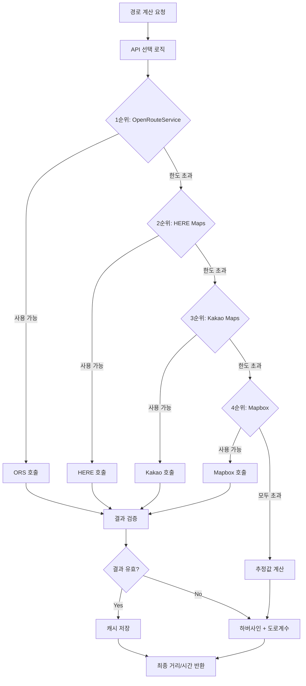
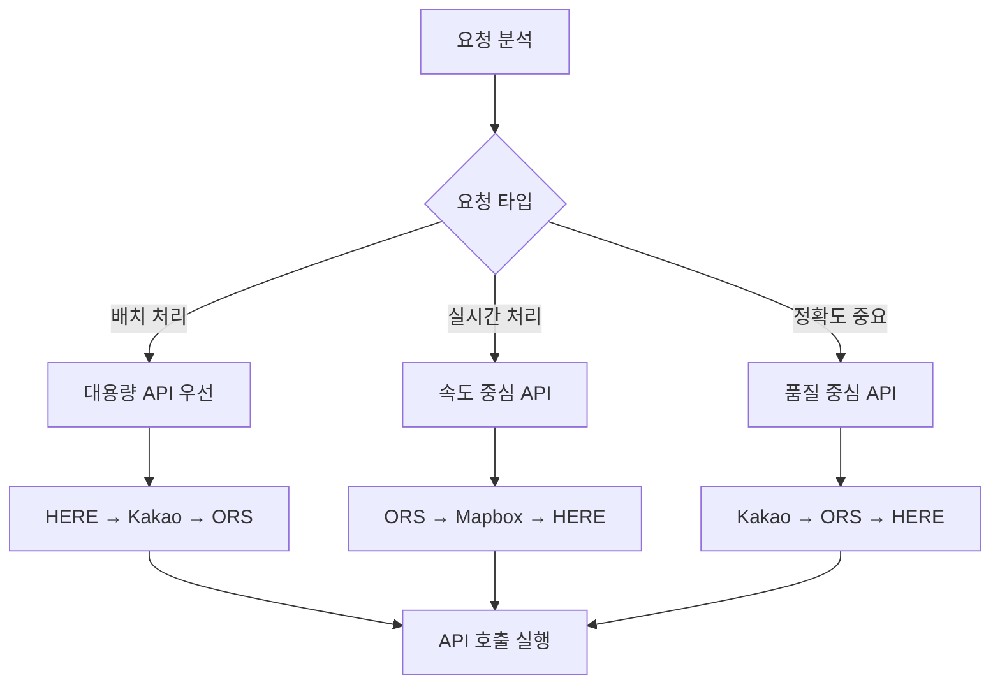
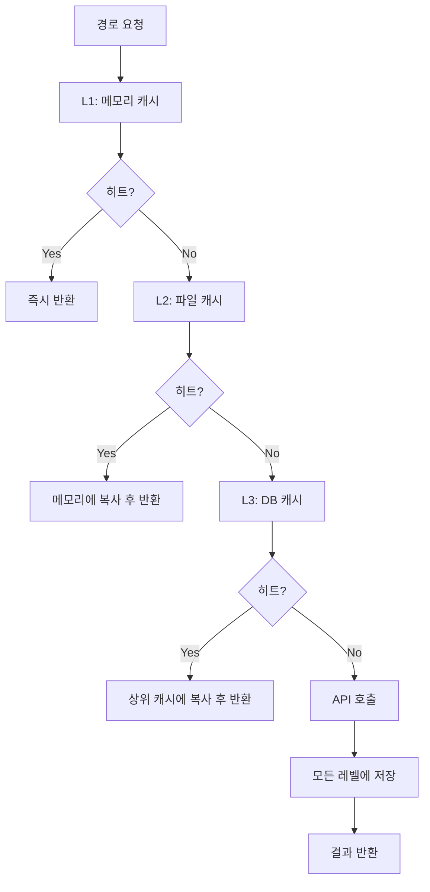
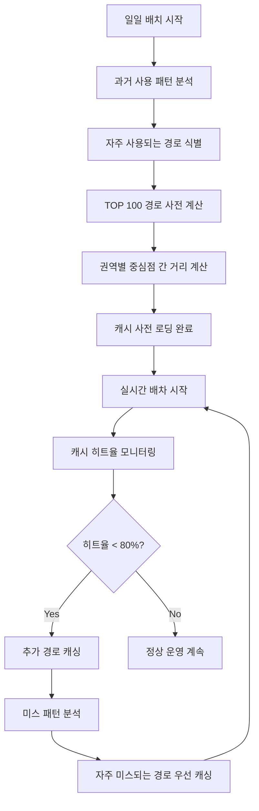
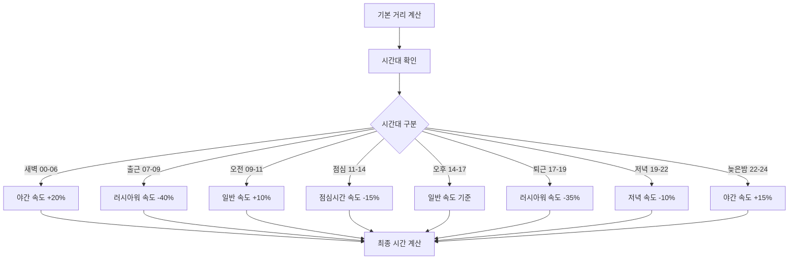
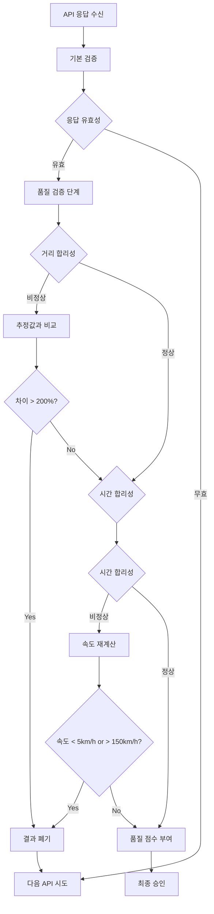
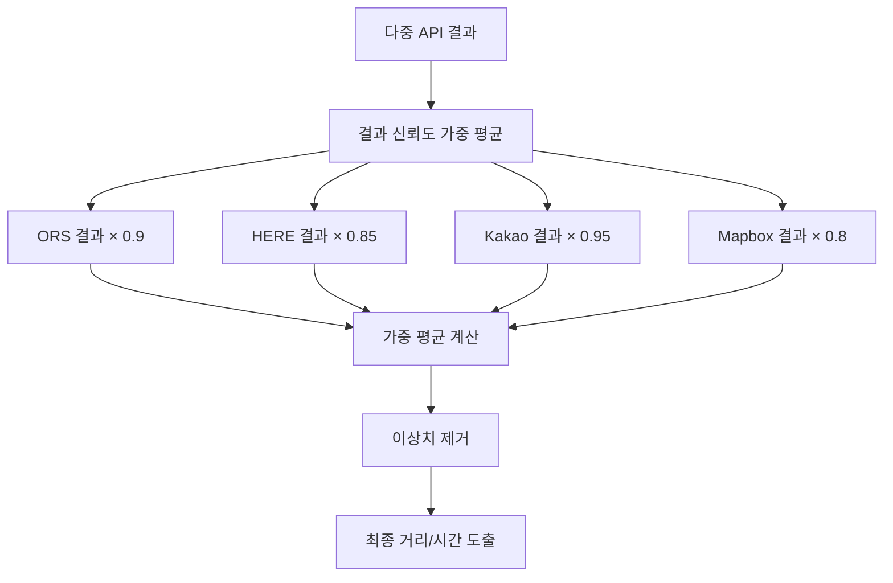
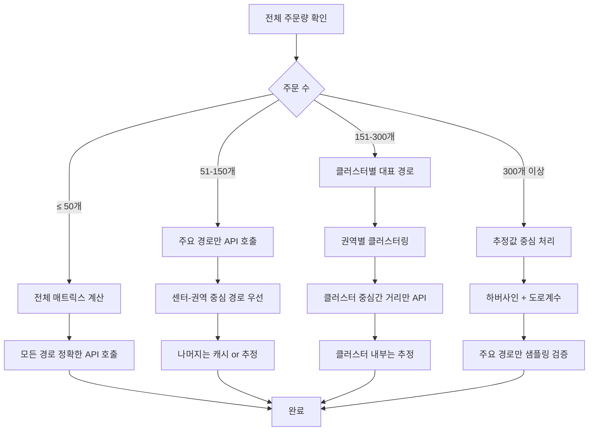
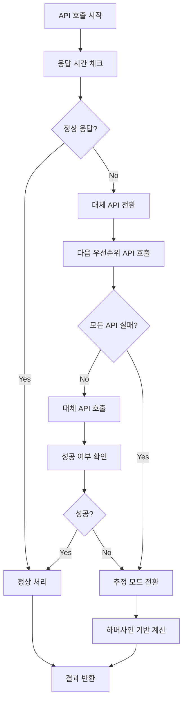

# TMS 배차 시스템 - 경로 최적화 및 API 전략

## 1. 무료 API 활용 최적화 전략

### 1.1 API 우선순위 및 로드밸런싱 룰



#### API별 한도 및 특성
```
OpenRouteService:
  - 일일 한도: 2,000건
  - 장점: 높은 정확도, 무료
  - 단점: 한도 제한
  - 사용 전략: 핵심 경로만 사용

HERE Maps:
  - 월간 한도: 250,000건 (일 8,333건)
  - 장점: 대용량, 실시간 교통정보
  - 단점: 복잡한 인증
  - 사용 전략: 주력 API로 활용

Kakao Maps:
  - 일일 한도: 300,000건
  - 장점: 한국 특화, 높은 정확도
  - 단점: 한국 전용
  - 사용 전략: 한국 내 최종 검증용

Mapbox:
  - 월간 한도: 50,000건 (일 1,666건)
  - 장점: 개발자 친화적
  - 단점: 한국 데이터 부족
  - 사용 전략: 백업용
```

### 1.2 지능형 API 선택 룰

#### 요청 특성별 API 선택


#### 시간대별 API 전략
```
새벽 시간 (00:00-06:00):
  - 모든 API 카운터 리셋
  - ORS를 최대한 활용
  - 다음 날 배치를 위한 캐시 구축

오전 시간 (06:00-12:00):
  - 실시간 배차 처리
  - HERE Maps 적극 활용
  - ORS는 핵심 경로만

오후 시간 (12:00-18:00):
  - 주문 폭증 대비
  - Kakao Maps 활용 증가
  - API 분산 처리

저녁 시간 (18:00-24:00):
  - 다음 날 준비
  - 캐시 미스 항목 보충
  - API 사용량 정리
```

## 2. 다층 캐싱 최적화 전략

### 2.1 캐시 레벨별 전략



#### 캐시 레벨별 특성 및 정책
```
L1 캐시 (메모리):
  - 용량: 1,000개 엔트리
  - TTL: 2시간
  - 정책: LRU 교체
  - 대상: 최근 사용된 경로

L2 캐시 (파일):
  - 용량: 50,000개 엔트리
  - TTL: 24시간
  - 정책: 일별 파일 분리
  - 대상: 당일 계산된 모든 경로

L3 캐시 (데이터베이스):
  - 용량: 무제한
  - TTL: 7일
  - 정책: 사용 빈도 기반
  - 대상: 영구 보존할 경로
```

### 2.2 지능형 캐시 관리

#### 캐시 워밍 전략


#### 캐시 무효화 룰
```
자동 무효화 조건:
  1. TTL 만료
  2. 날씨 조건 급변 (심각도 2.0 이상 변화)
  3. 교통사고 발생 (해당 경로)
  4. 도로공사 시작 (해당 구간)
  5. API 소스 변경 시

수동 무효화 트리거:
  1. 관리자 요청
  2. 데이터 품질 이슈 감지
  3. 시스템 업데이트 후
  4. 새로운 도로 개통 정보
```

## 3. 거리/시간 계산 최적화

### 3.1 한국 도로 특성 반영 계수

#### 지역별 도로 계수
```
서울 도심 (중구, 종로구):
  - 직선거리 × 2.1
  - 이유: 복잡한 도로망, 일방통행 많음

서울 강남 (강남구, 서초구):  
  - 직선거리 × 1.8
  - 이유: 격자형 도로, 지하차도 많음

서울 외곽 (강서구, 노원구):
  - 직선거리 × 1.5
  - 이유: 상대적으로 단순한 도로망

경기도 신도시:
  - 직선거리 × 1.4
  - 이유: 계획도시, 직선 도로 많음

경기도 구시가지:
  - 직선거리 × 1.7
  - 이유: 구불구불한 도로, 좁은 길

지방 대도시:
  - 직선거리 × 1.5  
  - 이유: 서울보다 단순하지만 여전히 복잡

농촌/산간 지역:
  - 직선거리 × 1.9
  - 이유: 우회로 많음, 산길 포함
```

### 3.2 시간대별 속도 조정 모델



#### 도로 타입별 기본 속도
```
고속도로:
  - 기본 속도: 80 km/h
  - 러시아워: 40 km/h
  - 심야시간: 90 km/h

간선도로:
  - 기본 속도: 50 km/h
  - 러시아워: 25 km/h  
  - 심야시간: 60 km/h

이면도로:
  - 기본 속도: 30 km/h
  - 러시아워: 20 km/h
  - 심야시간: 35 km/h

주택가 도로:
  - 기본 속도: 25 km/h
  - 모든 시간대 동일
```

## 4. 경로 품질 검증 및 개선

### 4.1 결과 품질 검증 룰



#### 품질 점수 계산 기준
```
정확도 점수 (40%):
  - API 신뢰도: ORS(90점), HERE(85점), Kakao(95점), Mapbox(80점)
  - 한국 도로 적합성: 추가 가점

일관성 점수 (30%):  
  - 같은 경로 반복 요청 시 일관성
  - 편차 5% 이내: 100점
  - 편차 5-10%: 80점
  - 편차 10% 이상: 60점

현실성 점수 (30%):
  - 평균 속도가 해당 지역 기준 범위 내
  - 극단적 값(너무 빠르거나 느림) 페널티
```

### 4.2 경로 최적화 후처리

#### 다중 API 결과 융합


#### 지역별 보정 로직
```
수도권 보정:
  - 한강 교량 횟수 × 3분 추가
  - 지하차도 구간 × 1.2배 시간
  - 학교 주변 × 1.1배 시간 (등하교 시간)

부산 보정:
  - 산복도로 구간 × 1.5배 시간
  - 해안도로 구간 × 0.9배 시간
  - 부산항 인근 × 1.3배 시간

대구 보정:
  - 달성공원 우회 × 1.2배 시간
  - 수성구 산지 × 1.4배 시간

광주/대전 보정:
  - 도심 원형 교차로 × 2분 추가
  - 신시가지 × 0.95배 시간
```

## 5. 최적화 성능 전략

### 5.1 주문량별 경로 계산 전략



#### 효율적 처리 전략
```
최적화 우선순위:

1단계 - 데이터 수집 최적화:
  - TMS 데이터 병렬 로딩
  - 날씨/교통 정보 비동기 수집
  - 캐시 우선 활용

2단계 - 경로 계산 최적화:
  - API 호출 병렬 처리
  - 지능형 캐시 활용
  - 거리 매트릭스 효율 구성

3단계 - 알고리즘 실행 최적화:
  - 복잡도 기반 알고리즘 선택
  - 권역별 병렬 처리
  - 품질 중심 해 도출

4단계 - 결과 처리 최적화:
  - 실시간 검증
  - 효율적 데이터 저장
```

### 5.2 오류 상황 대응 전략

#### API 장애 시 대응


#### 성능 저하 시 대응
```
성능 모니터링 및 조정:

실시간 성능 추적:
  - API 응답 시간 모니터링
  - 메모리 사용량 체크
  - 알고리즘 실행 시간 측정

자동 최적화 조정:
  - 느린 API 우선순위 하향
  - 캐시 히트율 개선
  - 병렬 처리 수준 조정

품질 vs 속도 균형:
  - 목표 품질 수준 설정
  - 합리적 처리 시간 내 완료
  - 필요시 단순 알고리즘 적용
```

이 문서는 TMS 배차 시스템의 경로 최적화와 API 활용 전략에 대한 상세한 룰과 로직을 제시합니다.