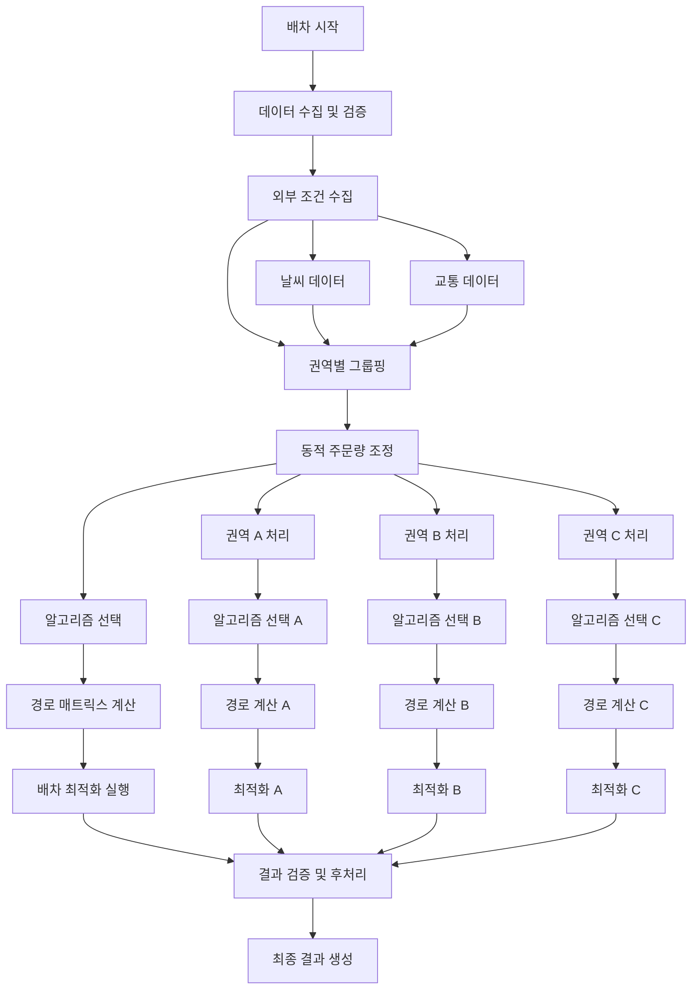
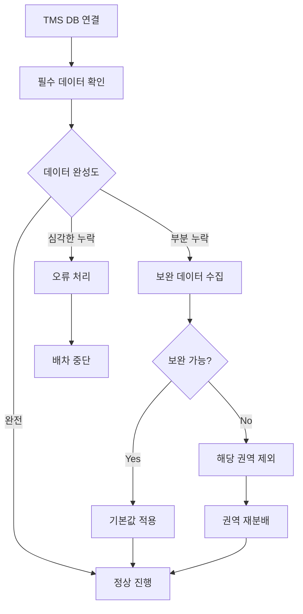
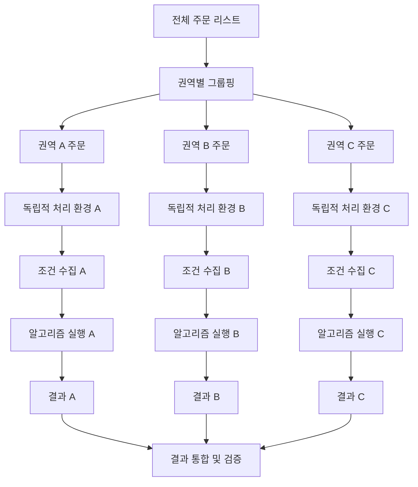
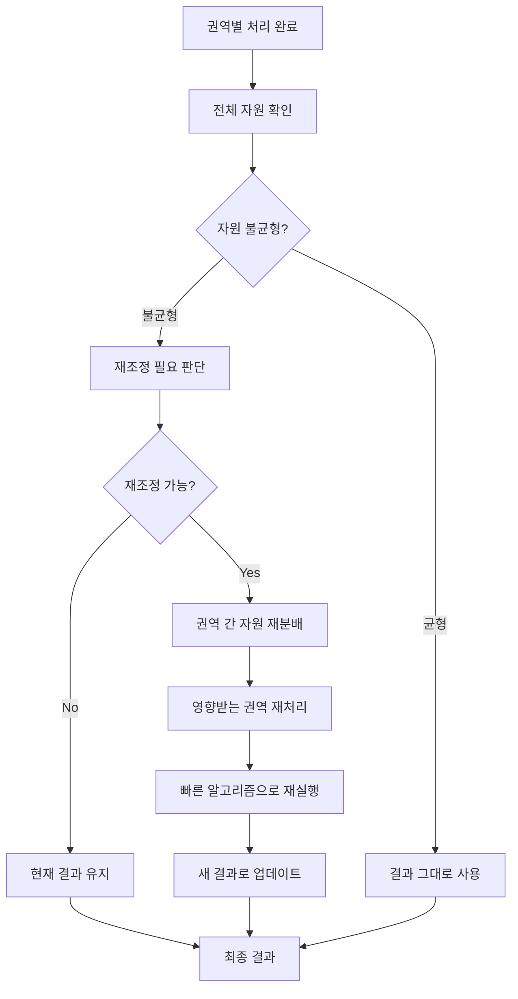
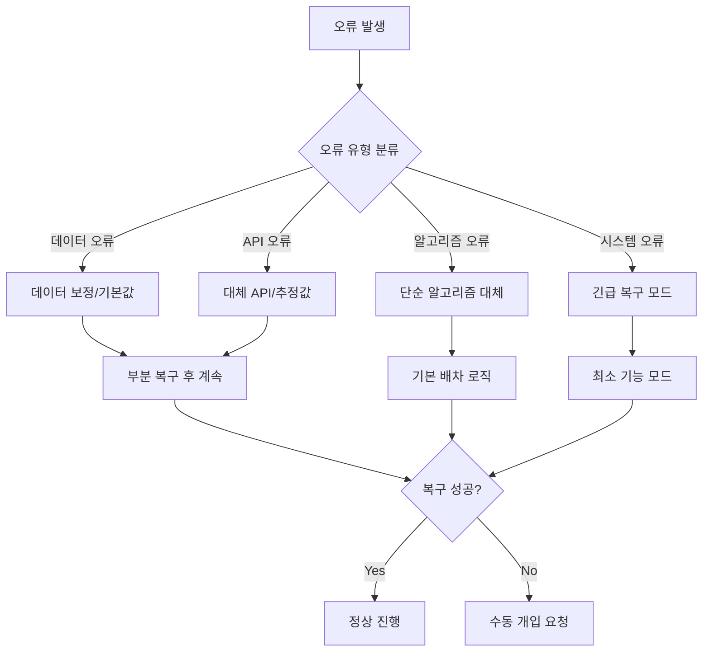
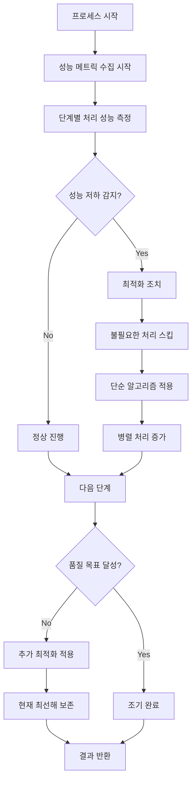
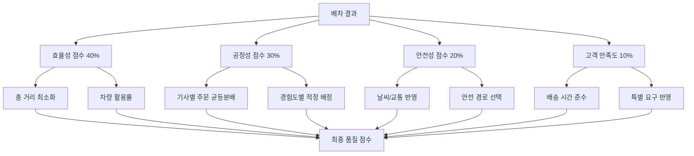

# TMS 배차 시스템 - 전체 프로세스 플로우 및 통합 로직

## 1. 전체 배차 프로세스 플로우

### 1.1 메인 프로세스 플로우



### 1.2 세부 단계별 처리 최적화

```
효율성 중심 처리 전략:

1단계 - 데이터 수집 최적화:
  - TMS DB 연결 및 데이터 추출 (병렬 처리)
  - 데이터 검증 및 정제 (실시간 검증)
  - 기본 구조 설정 (캐시 활용)

2단계 - 외부 조건 수집 최적화:
  - 날씨 API 호출 (권역별 비동기 처리)
  - 교통정보 API 호출 (캐시 우선 활용)

3단계 - 동적 조정 최적화:
  - 주문량 계산 (벡터화 연산)
  - 기사별 배정 조정 (병렬 계산)

4단계 - 경로 계산 최적화:
  - 거리 매트릭스 구성 (지능형 캐싱)
  - 캐시 처리 및 검증 (다층 캐시)

5단계 - 알고리즘 실행 최적화:
  - 권역별 병렬 최적화 (멀티프로세싱)
  - 결과 통합 (효율적 병합)

6단계 - 후처리 최적화:
  - 결과 검증 (품질 우선)
  - 최종 포맷팅 (구조화된 출력)
```

## 2. 데이터 수집 및 검증 룰

### 2.1 TMS 데이터 수집 우선순위



#### 데이터 필수도 분류
```
필수 데이터 (없으면 중단):
  - 주문 리스트 (ID, 위치, 권역)
  - 사용 가능한 차량/기사
  - 센터-권역 매핑 정보

중요 데이터 (없으면 기본값):
  - 기사 경험도 레벨
  - 권역 난이도 점수
  - 과거 배차 이력

선택 데이터 (없어도 진행):
  - 고객 우선순위
  - 특수 배송 요구사항
  - 과거 성능 통계
```

### 2.2 데이터 품질 검증 룰

```
주문 데이터 검증:
  - 위도/경도 유효성: -90~90, -180~180 범위
  - 주소 정보 완성도: 최소 구/군 단위 포함
  - 권역 매핑 확인: 기본 권역 자동 배정
  
차량 데이터 검증:
  - 현재 위치 유효성
  - 용량 정보 존재
  - 근무 시간 설정 확인

기사 데이터 검증:
  - 활성 상태 확인
  - 차량 연결 상태 확인  
  - 권한 및 자격 검증
```

## 3. 권역별 병렬 처리 전략

### 3.1 권역 분할 및 독립성 보장



#### 권역별 독립성 확보 원칙
```
데이터 독립성:
  - 각 권역 전용 데이터 복사본 생성
  - 권역 간 데이터 공유 최소화
  - 캐시도 권역별 분리 관리

처리 독립성:
  - 권역별 별도 스레드/프로세스
  - 한 권역 실패가 다른 권역에 영향 없음
  - 개별 권역별 성능 모니터링

자원 독립성:
  - API 호출 할당량 권역별 분배
  - 메모리 사용량 권역별 제한
  - CPU 시간 공정 분배
```

### 3.2 권역 간 조정이 필요한 경우



#### 권역 간 조정 트리거 조건
```
차량 부족 상황:
  - 특정 권역의 주문 대비 차량 부족률 > 30%
  - 인접 권역의 여유 차량 존재
  - 이동 시간이 배송 시간의 20% 이하

주문 폭증 상황:  
  - 특정 권역 주문량이 평상시 대비 200% 이상
  - 다른 권역의 주문량 여유 존재
  - 효율적 재조정 가능 여부 판단

긴급 상황:
  - 특정 권역에 자연재해/사고 발생
  - 해당 권역 배송 중단 또는 대폭 감소
  - 주문 이전 또는 연기 처리
```

## 4. 오류 처리 및 복구 전략

### 4.1 단계별 오류 대응 전략



#### 오류 심각도별 대응
```
Level 1 - 경미한 오류:
  - 일부 데이터 누락
  - 기본값으로 대체 후 계속
  - 로그 기록만 실시

Level 2 - 보통 오류:  
  - API 일시 장애
  - 대체 방법으로 우회
  - 관리자 알림 발송

Level 3 - 심각한 오류:
  - 핵심 기능 장애
  - 단순 모드로 전환
  - 즉시 관리자 개입

Level 4 - 치명적 오류:
  - 시스템 전체 장애
  - 배차 프로세스 중단
  - 긴급 복구 절차 실행
```

### 4.2 부분 실패 시 복구 전략

```
권역별 부분 실패:
  1. 실패한 권역 식별
  2. 해당 권역만 단순 알고리즘으로 재처리  
  3. 나머지 권역 결과와 통합
  4. 전체 품질 저하 최소화

API 부분 실패:
  1. 실패한 API 비활성화
  2. 대체 API로 자동 전환
  3. 캐시 및 추정값 적극 활용
  4. 처리 완료 후 실패 API 재검사

데이터 부분 실패:
  1. 누락된 데이터 유형 파악
  2. 보간법으로 데이터 추정
  3. 신뢰도 낮은 결과임을 표시
  4. 다음 배치에서 정확한 데이터 확보
```

## 5. 성능 최적화 및 모니터링 룰

### 5.1 실시간 성능 모니터링



#### 핵심 성능 지표
```
처리 시간 지표:
  - 단계별 소요 시간
  - 전체 처리 시간
  - API 응답 시간
  - 알고리즘 실행 시간

품질 지표:  
  - 총 배송 거리
  - 차량별 주문 분산도
  - 미배차 주문 비율
  - 제약조건 위반 횟수

자원 사용 지표:
  - 메모리 사용량
  - CPU 사용률  
  - API 호출 횟수
  - 캐시 히트율
```

### 5.2 적응적 성능 조정

```
성능 기반 동적 조정:

성능 저하 감지 시점:
  - API 응답 지연 감지
  - 복잡한 알고리즘 → 단순 알고리즘 자동 전환
  - API 호출 최소화 모드 활성화

품질 목표 미달 시점:
  - 현재 품질 수준 평가
  - 추가 최적화 필요성 판단
  - 기본 휴리스틱 보완 적용

최적화 완료 시점:
  - 목표 품질 달성 확인
  - 현재 최선해 확정
  - 조기 완료로 시스템 자원 절약
```

## 6. 최종 결과 검증 및 품질 보증

### 6.1 결과 검증 체크리스트

```
필수 검증 항목:
✓ 모든 주문이 배정되었는가?
✓ 차량별 용량 제한을 준수하는가?
✓ 기사별 근무시간을 준수하는가?  
✓ 권역별 배정이 올바른가?

품질 검증 항목:
✓ 총 배송 거리가 합리적인가?
✓ 차량별 주문 분산이 균등한가?
✓ 특별 요구사항이 반영되었는가?
✓ 과거 성능 대비 개선되었는가?

안전성 검증 항목:  
✓ 날씨 조건이 반영되었는가?
✓ 교통 상황이 고려되었는가?
✓ 기사 경험도가 적절한가?
✓ 위험 지역 배정이 적절한가?
```

### 6.2 품질 점수 계산



이 문서는 TMS 배차 시스템의 전체 프로세스와 통합 로직에 대한 상세한 룰을 제시합니다.