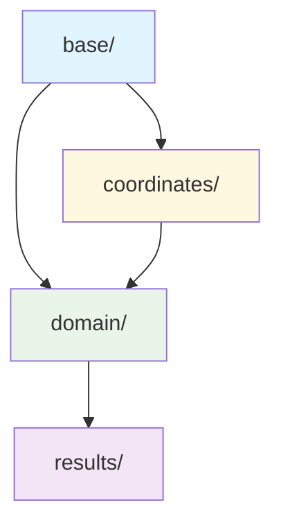

# 🏗️ TMS Router Models 구조 개선 설계

## 📊 현재 구조 분석

### 기존 Flat 구조의 문제점
```
core/models/
├── __init__.py              # 모든 엔티티 평면적 노출
├── coordinates.py           # 지리 정보
├── order.py                 # 주문 도메인
├── vehicle.py              # 차량 도메인  
├── region.py               # 권역 도메인
├── dispatch_result.py      # 배차 결과
└── map_display_result.py   # 지도 표시용
```

**문제점**:
1. **논리적 그룹핑 부족**: 관련 모델들이 분산
2. **의존성 불명확**: 모델 간 관계가 명시적이지 않음
3. **확장성 제한**: 새로운 도메인 추가 시 구조 혼재
4. **Import 복잡성**: 단일 `__init__.py`에서 모든 것 관리

## 🎯 개선된 구조 설계

### 논리적 계층 구조
```
core/models/
├── __init__.py                    # 깔끔한 통합 인터페이스
├── base/                          # 🔹 기본 클래스와 공통 요소
│   ├── __init__.py
│   ├── base_entity.py            # 기본 엔티티 추상 클래스
│   ├── value_objects.py          # 공통 값 객체 (ID, 시간 등)
│   └── enums.py                  # 프로젝트 전역 열거형
├── domain/                        # 🟦 핵심 비즈니스 도메인
│   ├── __init__.py
│   ├── order.py                  # 주문 엔티티 + 비즈니스 로직
│   ├── vehicle.py                # 차량 엔티티 + 비즈니스 로직
│   └── region.py                 # 권역 엔티티 + 비즈니스 로직
├── results/                       # 🟩 처리 결과 및 집계 모델
│   ├── __init__.py
│   ├── dispatch_result.py        # 배차 실행 결과
│   └── map_display_result.py     # UI 표시용 모델
└── coordinates/                   # 🟨 지리 정보 특화
    ├── __init__.py
    └── coordinates.py            # 좌표 값 객체 + 지리 계산
```

### 🔗 의존성 설계 원칙

#### 계층별 의존성 규칙


**의존성 규칙**:
1. **base/**: 다른 모듈에 의존하지 않음 (순수 추상화)
2. **coordinates/**: base만 의존 (지리 정보 특화)
3. **domain/**: base + coordinates 의존 (핵심 비즈니스)
4. **results/**: domain 엔티티들 참조 (집계 및 결과)

## 📁 세부 모듈 설계

### 1. base/ - 기본 추상화 계층

#### `base/base_entity.py`
```python
"""기본 엔티티 추상 클래스"""
from abc import ABC, abstractmethod
from datetime import datetime
from typing import Any, Dict

class BaseEntity(ABC):
    """모든 도메인 엔티티의 기본 클래스"""
    
    def __init__(self, id: str):
        self.id = id
        self.created_at = datetime.now()
        self.updated_at = datetime.now()
    
    @abstractmethod
    def validate(self) -> bool:
        """엔티티 유효성 검증"""
        pass
    
    def to_dict(self) -> Dict[str, Any]:
        """딕셔너리 변환"""
        return {
            'id': self.id,
            'created_at': self.created_at,
            'updated_at': self.updated_at
        }
    
    def __eq__(self, other) -> bool:
        """동등성 비교 (ID 기준)"""
        return isinstance(other, self.__class__) and self.id == other.id
```

#### `base/value_objects.py`
```python
"""공통 값 객체들"""
from dataclasses import dataclass
from typing import Optional
from datetime import datetime

@dataclass(frozen=True)
class EntityId:
    """엔티티 ID 값 객체"""
    value: str
    
    def __post_init__(self):
        if not self.value or not self.value.strip():
            raise ValueError("ID는 비어있을 수 없습니다")

@dataclass(frozen=True)
class Timestamp:
    """시간 값 객체"""
    value: datetime
    
    @classmethod
    def now(cls) -> 'Timestamp':
        return cls(datetime.now())
    
    def is_before(self, other: 'Timestamp') -> bool:
        return self.value < other.value
```

### 2. coordinates/ - 지리 정보 특화

#### `coordinates/coordinates.py` (개선됨)
```python
"""좌표 및 지리 계산 모듈"""
from dataclasses import dataclass
from typing import List, Tuple
from ..base import BaseEntity

@dataclass(frozen=True)
class Coordinates:
    """좌표 값 객체 - 불변"""
    latitude: float
    longitude: float
    
    def __post_init__(self):
        self._validate()
    
    def _validate(self):
        """좌표 유효성 검증"""
        if not (-90 <= self.latitude <= 90):
            raise ValueError(f"잘못된 위도: {self.latitude}")
        if not (-180 <= self.longitude <= 180):
            raise ValueError(f"잘못된 경도: {self.longitude}")
    
    def distance_to(self, other: 'Coordinates') -> float:
        """Haversine 거리 계산"""
        # 기존 구현 유지
        pass
    
    def to_tuple(self) -> Tuple[float, float]:
        return (self.latitude, self.longitude)

class GeoCalculator:
    """지리 계산 유틸리티"""
    
    @staticmethod
    def find_centroid(coordinates: List[Coordinates]) -> Coordinates:
        """중심점 계산"""
        if not coordinates:
            raise ValueError("좌표 리스트가 비어있습니다")
        
        lat_sum = sum(c.latitude for c in coordinates)
        lon_sum = sum(c.longitude for c in coordinates)
        count = len(coordinates)
        
        return Coordinates(lat_sum / count, lon_sum / count)
    
    @staticmethod
    def calculate_bounding_box(coordinates: List[Coordinates]) -> Tuple[Coordinates, Coordinates]:
        """경계 박스 계산"""
        if not coordinates:
            raise ValueError("좌표 리스트가 비어있습니다")
        
        min_lat = min(c.latitude for c in coordinates)
        max_lat = max(c.latitude for c in coordinates)
        min_lon = min(c.longitude for c in coordinates)
        max_lon = max(c.longitude for c in coordinates)
        
        return (
            Coordinates(min_lat, min_lon),  # 남서쪽 모서리
            Coordinates(max_lat, max_lon)   # 북동쪽 모서리
        )
```

### 3. domain/ - 핵심 도메인 계층

#### `domain/order.py` (개선됨)
```python
"""주문 도메인 모델"""
from dataclasses import dataclass
from datetime import datetime
from enum import Enum
from typing import Optional

from ..base import BaseEntity, EntityId
from ..coordinates import Coordinates

# 기존 Order 클래스를 BaseEntity 상속으로 개선
class Order(BaseEntity):
    """주문 엔티티"""
    
    def __init__(self, id: str, center_id: str, region_id: str, 
                 coordinates: Coordinates, address: str, 
                 priority: Priority = Priority.NORMAL):
        super().__init__(id)
        self.center_id = center_id
        self.region_id = region_id
        self.coordinates = coordinates
        self.address = address
        self.priority = priority
        self.status = OrderStatus.PENDING
        self.assigned_vehicle_id: Optional[str] = None
    
    def validate(self) -> bool:
        """주문 유효성 검증"""
        return (self.id and self.center_id and self.region_id 
                and self.coordinates and self.address)
    
    # 기존 비즈니스 메서드들 유지
    def assign_to_vehicle(self, vehicle_id: str, estimated_time: int = None):
        """차량에 할당"""
        # 기존 구현 유지
        pass
```

### 4. results/ - 결과 모델 계층

#### `results/dispatch_result.py` (개선됨)
```python
"""배차 결과 모델"""
from dataclasses import dataclass, field
from datetime import datetime
from typing import List, Dict, Optional

from ..domain import Order, Vehicle  # domain 계층에서 import
from ..base import BaseEntity

@dataclass
class DispatchResult(BaseEntity):
    """배차 결과 엔티티"""
    
    def __init__(self, batch_id: str, timestamp: datetime, status: DispatchStatus):
        super().__init__(batch_id)
        self.timestamp = timestamp
        self.status = status
        self.vehicle_assignments: List[VehicleAssignment] = []
        self.metrics: Optional[DispatchMetrics] = None
    
    def validate(self) -> bool:
        """결과 유효성 검증"""
        return self.id and self.timestamp and self.status
    
    # 기존 비즈니스 메서드들 유지
```

## 🔄 마이그레이션 계획

### Phase 1: 기본 구조 생성
1. ✅ 새로운 디렉토리 구조 생성
2. ✅ base/ 모듈 구현
3. ✅ coordinates/ 모듈 이동 및 개선

### Phase 2: 도메인 모델 이전
1. ✅ domain/ 디렉토리로 모델 이동
2. ✅ BaseEntity 상속 적용
3. ✅ 의존성 정리

### Phase 3: 결과 모델 정리
1. ✅ results/ 디렉토리로 이동
2. ✅ Import 경로 업데이트

### Phase 4: 통합 및 테스트
1. ✅ 새로운 `__init__.py` 구성
2. ✅ 기존 코드와의 하위 호환성 확인
3. ✅ 전체 시스템 테스트

## 🎯 개선 효과

### 1. **논리적 명확성**
```python
# Before: 평면적 구조
from core.models import Order, DispatchResult, Coordinates

# After: 계층적 구조
from core.models.domain import Order
from core.models.results import DispatchResult  
from core.models.coordinates import Coordinates

# 또는 통합 인터페이스
from core.models import Order, DispatchResult, Coordinates  # 여전히 동작
```

### 2. **확장성 향상**
```python
# 새로운 도메인 추가 시
core/models/domain/customer.py       # 고객 도메인
core/models/domain/route.py          # 경로 도메인  
core/models/results/analytics.py     # 분석 결과
```

### 3. **테스트 편의성**
```python
# 계층별 독립적 테스트 가능
tests/models/base/test_base_entity.py
tests/models/domain/test_order.py
tests/models/results/test_dispatch_result.py
```

### 4. **의존성 명확화**
- **순환 의존성 방지**: 계층적 구조로 의존성 방향 명확
- **인터페이스 분리**: 각 계층별 명확한 책임
- **확장성**: 새로운 모델 추가 시 기존 구조 영향 최소화

## 🔧 구현 권장사항

### 1. **점진적 마이그레이션**
- 기존 코드 호환성 유지하며 단계적 이전
- 새로운 기능부터 개선된 구조 적용

### 2. **문서화 강화**
- 각 계층의 역할과 책임 명시
- 의존성 규칙 문서화

### 3. **타입 힌팅 강화**
- 모든 모델에 완전한 타입 힌팅
- mypy 호환성 확보

### 4. **검증 로직 표준화**
- BaseEntity의 validate() 메서드 활용
- 공통 검증 패턴 정의

이 구조 개선을 통해 TMS Router의 모델 계층이 더욱 명확하고 확장 가능한 형태로 발전할 것입니다! 🚀